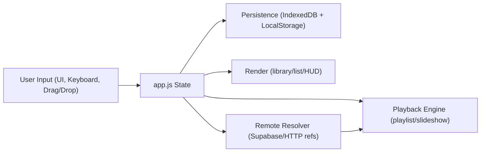

# Blend Player v5 (slideshow-playlist-player.html)

Blend is a local-first, browser-based dual-layer media studio. It lets you run a **Playlist layer** (video/audio) and a **Slideshow layer** (image/video) at the same time, then blend them live with independent controls.

> Source of truth for this README: `src/blend.v5.0.5/`

## Table of Contents

- [Project Description](#project-description)
- [Current Version Information](#current-version-information)
- [Screenshots](#screenshots)
- [Quick Start](#quick-start)
- [Installation](#installation)
- [Running Locally](#running-locally)
- [Feature Matrix](#feature-matrix)
- [Detailed Feature Documentation](#detailed-feature-documentation)
- [User Guide](#user-guide)
- [Playback Controls](#playback-controls)
- [Keyboard Shortcuts](#keyboard-shortcuts)
- [Touch Controls](#touch-controls)
- [Accessibility](#accessibility)
- [Mobile Usage](#mobile-usage)
- [Desktop Usage](#desktop-usage)
- [Supported File Types](#supported-file-types)
- [Import/Export Formats](#importexport-formats)
- [Configuration Reference](#configuration-reference)
- [Data Persistence, Storage, and Privacy](#data-persistence-storage-and-privacy)
- [Architecture Documentation](#architecture-documentation)
- [Browser Compatibility](#browser-compatibility)
- [What Works](#what-works)
- [Known Limitations](#known-limitations)
- [Known Issues](#known-issues)
- [Troubleshooting Guide](#troubleshooting-guide)
- [FAQ](#faq)
- [Developer Documentation](#developer-documentation)
- [Future Development and Recommended Improvements](#future-development-and-recommended-improvements)
- [Changelog Reference](#changelog-reference)
- [Contributing](#contributing)
- [Credits](#credits)
- [License](#license)

## Project Description

### What the application does

Blend combines two synchronized media layers:

- **Playlist layer**: video + audio sequence
- **Slideshow layer**: image + video sequence

You can play both at once, mix visibility using a blend slider, and control each layer volume plus a master volume.

### Primary use cases

- Event and venue playback
- DJ/VJ-style ambient media mixing
- Local/private playback sessions
- Curated “experience” packages (playlist + slideshow + settings)

### Target users

- Creators and curators
- Event operators
- Users who want local-first playback without uploading files

### Key capabilities

- Local media library with folder/file/url import
- Multi-experience catalog (save/switch/import/export experiences)
- List editing (sort, shuffle, reverse, drag reorder)
- Deep links and sharing links
- Supabase-based remote media URL resolution (public + signed private URLs)
- PWA shell with service worker caching for app assets

### Browser-based architecture

- No framework runtime dependency
- ES modules + browser-native APIs
- IndexedDB + LocalStorage persistence
- Local-only operation for local files (network used only for configured remote features)

## Current Version Information

- **Recommended implementation directory:** `src/blend.v5.0.5/`
- **Authoritative app entry:** `src/blend.v5.0.5/index.html`
- **Compatibility redirect entry:** `src/blend.v5.0.5/slideshow-playlist-player.html`
- **Runtime app version string in code/UI:** `5.0.0`
- **Cache/app shell version key:** `blend-player-v5.0.0-20260622-supabase-storage`

Latest source location:

- [Repository root](https://github.com/mytech-today-now/slideshow-playlist-player.html)
- [Current implementation folder](https://github.com/mytech-today-now/slideshow-playlist-player.html/tree/main/src/blend.v5.0.5)

## Screenshots

> Placeholder references (replace with real captures as available).


## Quick Start

1. Open `src/blend.v5.0.5/index.html` from a local server.
2. Press `C` (or click the gear icon) to open the configuration panel.
3. Add media using one of these actions:
   - `Add Files` for individual files
   - `Add Folder` for recursive folder scan
   - `Add URL` for `http(s)`, `supabase://`, or legacy `ipfs://` references
4. Select items in Media Library and add to Playlist/Slideshow.
5. Press `Play` and adjust `Blend`, volume, and transitions.

## Installation

No build step is required for normal playback.

For testing/dev in `src/blend.v5.0.5`:

```bash
npm install
```

## Running Locally

### Option A: serve the implementation folder directly

```bash
cd src/blend.v5.0.5
npx serve -l 5173 --cors
```

Then open:

```text
http://localhost:5173/index.html
```

### Option B: serve from repository root

```bash
python -m http.server 5173
```

Then open:

```text
http://localhost:5173/src/blend.v5.0.5/index.html
```

## Feature Matrix

| Area | Capability | Status | Notes |
|---|---|---|---|
| Playback | Dual-layer playback | Yes | Playlist + Slideshow layers run independently |
| Playback | Blend opacity control | Yes | Live slider + keyboard (`[` / `]`) |
| Playback | Master + per-layer volume | Yes | Playlist, Slideshow, Master |
| Playback | Experience playback modes | Yes | Loop, Stop at End, Go to Next Experience |
| Playback | Fullscreen | Yes | `requestFullscreen()` on viewport |
| Library | Add files | Yes | File System Access API + input fallback |
| Library | Add folder (recursive) | Yes | Directory picker + fallback; depth limit 6 |
| Library | Add URL | Yes | `http(s)`, `supabase://`, legacy `ipfs://` refs |
| Library | Drag-and-drop import | Yes | Files/directories/list files |
| Library | Search/filter/sort | Yes | Type + source filters, worker projection for large sets |
| Lists | Playlist editor | Yes | Drag reorder, sort, shuffle, reverse, import/export |
| Lists | Slideshow editor | Yes | Per-image duration, per-video include-audio toggle |
| Lists | Unavailable item preservation | Yes | Experience import can keep “Not Available” placeholders |
| Persistence | IndexedDB state | Yes | Library, lists, settings, experiences, thumbnails, dir handles |
| Persistence | LocalStorage state | Yes | Active experience, banners, consent, runtime overrides |
| Import/Export | List JSON/TXT import-export | Yes | `.json`, `.jsonl`, `.txt`, `.md` import |
| Import/Export | Experience JSON import-export | Yes | Schema `player.blend.experience.v2` |
| Remote Media | Supabase URL resolution | Yes | Public object URLs + signed private URLs |
| Sharing | Deep links | Yes | `exp`, `layer`, `item`, optional `autoplay` |
| Sharing | Social share menu | Yes | Native share, copy, and platform links |
| PWA | Service worker shell cache | Yes | App shell cached; media/range requests bypass cache |

## Detailed Feature Documentation

### Slideshow Features

- Supports **images** and **videos**.
- Mixed slideshow media is supported.
- Manual navigation via viewport arrows and keyboard (`←`/`→` or `J`/`L`).
- Per-item controls in Slideshow list:
  - Image: `displayDuration` (seconds)
  - Video: `includeAudio` toggle
- Transition system includes:
  - 17 transition effects
  - weighted effect selection
  - randomized or ordered sequencing
  - max heavy effects in a row
  - duration and overlap controls
  - optional FPS monitor + auto quality adjustment

### Playlist Features

- Supports **video** and **audio**.
- Mixed playlist media is supported.
- Playback controls: Prev / Play-Pause / Next / Stop.
- Seek 10%-90% with keys `1`-`9` (active playlist video).
- Queue/list management:
  - shuffle, reverse, sort
  - drag reorder
  - remove item with undo toast
- Internal behavior:
  - sequential mode is default and UI-exposed behavior
  - random mode code path exists and uses history for previous navigation

### Import Features

#### Images

- Drag-and-drop: Yes
- File picker: Yes
- Folder import: Yes
- Batch import: Yes
- URL import: Yes (`http(s)`, `supabase://`, legacy `ipfs://`)
- JSON import: Yes (via list/experience imports)

#### Videos

- Drag-and-drop: Yes
- File picker: Yes
- Folder import: Yes
- Batch import: Yes
- URL import: Yes (`http(s)`, `supabase://`, legacy `ipfs://`)
- JSON import: Yes

#### Audio

- Drag-and-drop: Yes
- File picker: Yes
- Folder import: Yes
- Batch import: Yes
- URL import: Yes (`http(s)`, `supabase://`, legacy `ipfs://`)
- JSON import: Yes

#### Playlists and Lists

- List import supports `.json` / `.jsonl` / `.txt` / `.md`.
- Active list target can be Playlist or Slideshow.
- Import behavior supports `Append` or `Replace current list`.
- List export supports:
  - JSON (`player.blend.list.v1`)
  - `.txt` (quoted path/reference per line)

#### Experiences

- Experience import supports `.json` (schema includes `experience` payload)
- Experience export produces timestamped JSON with settings snapshot, media library snapshot, and playlist/slideshow snapshots.

#### External Sources

Supported external reference forms:

- `https://...`
- `supabase://bucket/path/to/object`
- `bucket/path/to/object` shorthand (resolved via default bucket rules)
- legacy `ipfs://CID/...` (mapped by resolver rules)

### Import workflows (step-by-step)

#### Add Files

1. Open config panel.
2. Click `Add Files`.
3. Select media files.
4. Files appear in Media Library.

#### Add Folder

1. Open config panel.
2. Click `Add Folder`.
3. Choose a folder.
4. App recursively scans (up to configured depth) and imports supported media.

#### Add URL

1. Open config panel.
2. Click `Add URL`.
3. Paste one or more references (space/comma separated).
4. App validates and stores resolvable media references.

#### Drag-and-drop to Media Library

1. Drag files/folders from OS to Media Library grid.
2. Supported items are imported.
3. Dropped directories are scanned recursively.

#### Drag-and-drop list file into Playlist/Slideshow

1. Drag `.txt`/`.md`/`.json`/`.jsonl` file onto list editor.
2. List entries are parsed and imported into that list.
3. Missing paths can be resolved later.

#### Resolve missing paths

1. After import, click `Resolve now` or `Resolve missing paths...`.
2. Choose a folder.
3. App scans and matches missing entries by basename.

## User Guide

### Loading Media

- Use `Add Files` for one-off selection.
- Use `Add Folder` for event/session content batches.
- Use `Add URL` for remote references.
- Use source filters (`All`, `Local`, `URL`) to manage mixed libraries.

### Creating Slideshows

1. Select `Images`/`Video`/`All` in library filters as needed.
2. Multi-select media.
3. Click `Add Selected -> Slideshow`.
4. Set image durations and video `Include audio` options in the list.

### Creating Playlists

1. Select `Audio`/`Video` in library filters.
2. Multi-select media.
3. Click `Add Selected -> Playlist`.
4. Reorder/sort/shuffle as needed.

### Managing Media

- Search by filename/path.
- Sort Media Library by name/path/size/type/date/duration/metadata.
- Remove selected items from library.
- `Clear View` removes unreferenced library entries while preserving items used by saved experiences.
- `Remove Stale` deletes entries marked inaccessible.

### Saving Configurations

- Most edits are auto-saved to IndexedDB.
- Experience changes are persisted automatically.
- Active experience id is also stored in LocalStorage.

### Exporting Data

From `Export...`:

- Export list JSON
- Export list TXT
- Export media library JSON
- Export full experience JSON

### Importing Data

- `Import List...` imports list entries into active list.
- `Experience -> Import` imports one or more experience JSON files.

### Playback Controls

- Transport bar controls both layers.
- Blend slider adjusts slideshow opacity over playlist.
- Volume controls include Playlist, Slideshow, and Master (+ mute).

### Best Practices

- Keep local and remote assets separated using source filters.
- Export full experience JSON as a backup before major edits.
- For large libraries, use folder organization and list-specific curation.
- Use `Remove Stale` regularly after moving/renaming local files.

### Large Library Performance Tips

- Library/list UIs are virtualized; keep search/filter narrowed during heavy curation.
- Worker-based library projection kicks in for large collections (threshold in code: 800 items).
- Thumbnail cache is bounded; avoid rapid, repeated full-library resorting during playback.
- Split very large sets across multiple experiences for faster switching and safer backups.

### Backup Recommendations

- Regularly export Full Experience JSON and Media Library JSON.
- Keep exported files in versioned backups.

## Playback Controls

| Control | Description |
|---|---|
| `Prev` | Previous item/layer progression |
| `Play/Pause` | Toggle both layers |
| `Next` | Next item/layer progression |
| `Stop` | Stop playback and reset indices |
| `Blend` | Set slideshow opacity over playlist |
| `Fullscreen` | Toggle viewport fullscreen |
| `Mute` | Toggle master mute |
| `Master Volume` | Global volume multiplier |

## Keyboard Shortcuts

| Shortcut | Action |
|---|---|
| `Space` / `K` | Play/pause both layers |
| `Left` / `J` | Previous |
| `Right` / `L` | Next |
| `[` / `]` | Blend opacity -/+ 10% |
| `C` | Toggle config panel |
| `F` | Toggle fullscreen |
| `M` | Toggle master mute |
| `1`-`9` | Seek 10%-90% in current playlist video |
| `/` | Focus library search |
| `Alt+S` | Open Media Library sort menu |
| `Delete` / `Backspace` | Remove focused list item |
| `?` | Open help modal |
| `Esc` | Close menus/modals/panel |

## Touch Controls

Implemented touch-friendly behavior:

- Large touch targets in controls and lists
- Pointer-based list reordering fallback (long-press/drag behavior)

Note:

- Help modal currently lists swipe gestures for navigation/blend tuning.
- Explicit swipe gesture handlers are **not** present in `app.js` in this version.

## Accessibility

Implemented accessibility-oriented behavior includes:

- Skip link (`Skip to controls`) for keyboard users.
- ARIA labels/roles across transport, dialogs, listboxes, and status regions.
- Keyboard-first operation for core playback and editing workflows.
- Visible focus states and assistive announcement regions (`aria-live`).
- Reduced-motion awareness in transition manager via `prefers-reduced-motion`.

## Mobile Usage

- Works on modern mobile browsers for core playback and editing.
- iOS install guidance is provided through install/help banner.
- Folder/file API support varies by browser; fallback input flows are used where possible.

## Desktop Usage

- Best overall experience on Chromium browsers.
- Full File System Access APIs improve folder workflows and persistence.
- Keyboard-first workflows are fully supported.

## Supported File Types

### Image Formats

| Format | Supported | Notes |
|---|---|---|
| `.jpg` / `.jpeg` | Yes | Browser decode support required |
| `.jfif` | Yes | JPEG container variant; treated as image media |
| `.png` | Yes |  |
| `.apng` | Yes | Animated PNG decode behavior is browser-dependent |
| `.webp` | Yes |  |
| `.gif` | Yes | Animated decode behavior is browser-dependent |
| `.svg` | Yes | Rendered as image media |
| `.bmp` | Yes | Uncompressed/legacy bitmap support varies by engine |
| `.ico` | Yes | Treated as image media; icon size support varies |
| `.avif` | Yes | Browser codec support required |
| `.heic` / `.heif` | Yes | Browser codec support is inconsistent across engines |

### Video Formats

| Format | Supported | Notes |
|---|---|---|
| `.mp4` | Yes |  |
| `.m4v` | Yes | Treated as `video/mp4` |
| `.mov` / `.qt` | Yes | Explicit QuickTime MIME handling in code |
| `.mkv` | Yes | Browser codec support varies |
| `.webm` | Yes |  |
| `.ogv` | Yes |  |
| `.avi` | Yes | Browser codec support varies |

### Audio Formats

| Format | Supported | Notes |
|---|---|---|
| `.mp3` | Yes |  |
| `.m4a` | Yes |  |
| `.wav` | Yes |  |
| `.ogg` | Yes |  |
| `.flac` | Yes | Browser support varies |
| `.aac` | Yes | Browser support varies |

### Playlist/List Import Formats

| Format | Supported | Notes |
|---|---|---|
| `.json` | Yes | List/library/experience-compatible parsing paths |
| `.jsonl` | Yes | One JSON record per line |
| `.txt` | Yes | Quoted paths/URLs and delimiter parsing |
| `.md` | Yes | Markdown list parsing + path extraction |

### Configuration and Persistence Formats

| Format | Supported | Notes |
|---|---|---|
| IndexedDB object stores | Yes | Main persistent application state |
| LocalStorage key-values | Yes | UI/session flags, consent, runtime overrides |
| Runtime config JSON (`blend-runtime-config-v1`) | Yes | Optional override path for Supabase/runtime settings |

### Export Formats

| Format | Supported | Notes |
|---|---|---|
| List JSON (`player.blend.list.v1`) | Yes | Playlist or Slideshow export |
| List TXT | Yes | Quoted path/reference lines |
| Media Library JSON (`player.blend.library.v1`) | Yes | Current sorted order exported |
| Experience JSON (`player.blend.experience.v2`) | Yes | Settings + library + both lists |

## Import/Export Formats

### List JSON (`player.blend.list.v1`)

Includes:

- `version`, `schema`, `type`
- list metadata (`name`, `description`, `createdAt`)
- project metadata (`project`, `exportedAt`)
- `order` array and `items[]`

### Library JSON (`player.blend.library.v1`)

Includes:

- sorted `items[]`
- `sort` metadata (key/dir)
- `order` array

### Experience JSON (`player.blend.experience.v2`)

Includes:

- experience metadata (`id`, `name`, `project`)
- exported settings snapshot
- library snapshot
- playlist + slideshow snapshots

Import behavior rules:

- `Append` adds items.
- `Replace current list` replaces active list, but restores previous list if nothing valid imports.
- Missing items can be resolved via folder scan.

## Configuration Reference

### Global/User Settings

| Setting | UI Control | Stored | Notes |
|---|---|---|---|
| Import behavior | `#import-behavior` | IndexedDB settings | `append` or `replace` |
| Theme | `#theme-mode` | IndexedDB settings | `auto`, `dark`, `light` |
| Effect intensity | `#effect-intensity` | IndexedDB settings | Ken Burns intensity multiplier |
| Experience playback mode | `#experience-playback-mode` | IndexedDB settings | `loop`, `stop`, `next-experience` |
| Loop experience catalog | `#loop-experience-catalog` | IndexedDB settings | Wrap to first experience |
| Default image duration | `#default-duration` | IndexedDB settings | Seconds |
| Transition duration | `#transition-duration` | IndexedDB settings | 200-10000 ms |
| Transition overlap | `#transition-overlap` | IndexedDB settings | 0-10000 ms |
| Transition randomize order | `#transition-randomize-order` | IndexedDB settings | Weighted random vs ordered |
| Max heavy transitions in row | `#transition-max-heavy` | IndexedDB settings | 0-8 |
| Enabled transitions + weights | Transition picker | IndexedDB settings | Per-effect enable + weight |
| Auto quality adjust | `#quality-auto-adjust` | IndexedDB settings | FPS-driven quality tier |
| Show FPS monitor | `#show-transition-fps` | IndexedDB settings | HUD monitor |
| Resume on load | `#resume-on-load` | IndexedDB settings | Persisted setting (see limitations) |
| Auto verify on startup | `#auto-verify` | IndexedDB settings | Verifies file handles |
| Analytics consent | `#analytics-consent` | LocalStorage + runtime | Also gated by browser privacy signals |
| Supabase default bucket | `#supabase-default-bucket` | IndexedDB settings | Default storage bucket |
| Signed URL TTL | `#supabase-signed-url-ttl` | IndexedDB settings | Seconds |
| Require auth for private media | `#private-media-auth-required` | IndexedDB settings | Controls auth expectation |
| Playlist volume | `#vol-playlist` | IndexedDB settings | 0.0-1.0 |
| Slideshow volume | `#vol-slideshow` | IndexedDB settings | 0.0-1.0 |
| Master volume | `#vol-master` | IndexedDB settings | 0.0-1.0 |

Advanced/internal settings present in state:

- `playbackModePlaylist`
- `playbackModeSlideshow`

These are persisted but not currently exposed by dedicated UI controls in this version.

## Data Persistence, Storage, and Privacy

### IndexedDB stores

Database: `player-blend-v1` (version `4`)

Stores:

- `library`
- `playlist`
- `slideshow`
- `settings`
- `experiences`
- `thumbnails`
- `dirHandles`

### LocalStorage keys used

- `blend-active-experience-id`
- `blend-install-banner-hidden-v4`
- `blend-welcome-v4`
- `blend-analytics-consent-v1`
- `blend-share-mastodon-instance-v1`
- `blend-runtime-config-v1`
- `blend-supabase-auth-session-v1`
- `blend-debug-log-v1`

### Privacy and security notes

- Local media files are not uploaded by default.
- Browser-side path sanitization rejects control chars and `..` traversal.
- Remote references are validated and normalized.
- Supabase API tokens are stored in LocalStorage session structure.
- Google Analytics script is included in `index.html`; event tracking is controlled by consent + privacy signals.

### Browser permissions

- Local file playback can require browser-granted read permission for stored file handles.
- On startup, auto-verify can mark entries as stale when handle access is no longer granted.
- Supabase private media access requires a valid API token/session in this browser profile.

### Offline behavior

- Service worker caches app shell assets.
- Media and range requests bypass cache and go to network/local handles.
- Remote URLs still require connectivity.

### Reset and cache management

Use **Clear Browser Storage** to remove browser-side data:

- IndexedDB data
- selected LocalStorage keys
- Blend service worker/cache entries

Media files on disk are not deleted.

## Architecture Documentation

### Front-end architecture

- HTML shell (`index.html`) + CSS (`styles.css`) + JS modules.
- Main orchestration in `app.js`.
- Feature modules:
- `transition-manager.js`
- `storage-url-resolver.js`
- `supabase-auth.js`
- `supabase-config.js`
- `drag-sort.js`
- `logger.js`

### Data flow



### State management

Single in-memory `state` object manages:

- library map + directory handles
- playlist/slideshow arrays
- list metadata
- settings
- experience catalog + active experience
- runtime playback position and history

### Event handling

- UI event handlers wired in `wireTransport`, `wireConfig`, `wireKeyboard`.
- Drag-and-drop supports internal reorder plus external files/directories/list imports.
- Playback completion handler coordinates end-of-experience behavior.

### Browser Technologies and APIs

| API / Technology | Usage |
|---|---|
| HTML5 / CSS3 / JS (ES Modules) | Core UI and application logic |
| IndexedDB | Persistent app data and thumbnails |
| LocalStorage | UI/session flags, consent, auth/session, runtime config |
| File System Access API | File and directory pickers, persistent handles |
| File input fallback | Browser fallback when File System Access unavailable |
| Drag and Drop API | OS file/folder drops and list imports |
| Media APIs (`<video>`, ``, media events) | Playback and slideshow rendering |
| Fullscreen API | Viewport fullscreen |
| Service Worker + Cache Storage | App shell caching |
| Web Share API | Native share sheet |
| Clipboard API | Copy link fallback |
| URL/History APIs | Deep links and cleaned auth hash |
| Web Animations API + CSS capabilities | Transition effects |
| `requestAnimationFrame` | Ken Burns and monitoring loops |
| `matchMedia` | Theme/reduced-motion and install logic |

### Dependencies

Runtime:

- No front-end framework dependency required for core app logic.
- External script in `index.html`:
- Google gtag script (`googletagmanager.com`) for analytics integration.

Remote services (optional/by configuration):

- Supabase Auth endpoints
- Supabase Storage public/signed URL endpoints

Dev/test (`src/blend.v5.0.5/package.json`):

- `@playwright/test`
- `esbuild`

## Browser Compatibility

| Browser | Expected Support | Notes |
|---|---|---|
| Chrome (desktop) | Best | Full feature set, best File System Access support |
| Edge (desktop) | Best | Full feature set, Chromium parity |
| Firefox | Partial | Uses fallback file input flows; no full directory handle persistence |
| Safari (desktop) | Partial | Fallback flows; fullscreen and file APIs vary |
| iOS Safari | Partial | Install guidance provided; file/folder flows constrained by platform APIs |
| Android Chrome | Good | Core workflows + install banner supported |

Compatibility notes:

- Actual media decode depends on browser codec support.
- HEIC/HEIF and some MKV/AVI/FLAC/AAC combinations may vary by browser/platform.

## What Works

Verified in current implementation:

- Dual-layer playback with blend and volume control.
- Experience create/rename/delete/import/export lifecycle.
- Media library add (files, folders, URLs), drag/drop, search/filter/sort.
- Playlist/slideshow editing (add, remove, reorder, sort, shuffle, reverse).
- List and experience import/export flows with validation and recovery UI.
- Supabase token auth modal/session handling.
- Remote media resolution for `http(s)` + `supabase://` + legacy `ipfs://` mapping.
- Deep-link loading (`exp`, `layer`, `item`, `autoplay`).
- Service worker install and app shell caching.

## Known Limitations

- Swipe gesture shortcuts shown in help are not backed by explicit swipe handlers in `app.js`.
- `resumeOnLoad` is persisted as a setting, but startup does not auto-toggle playback from saved runtime state in current bootstrap flow.
- Playlist/slideshow playback mode fields exist in settings, but only playlist random branch is code-supported; no dedicated UI selector is exposed for layer playback modes.
- Folder scanning depth is capped (`MAX_FOLDER_DEPTH = 6`).
- Remote URL parsing generally requires media-like filenames/extensions for text list imports.
- Service worker intentionally does not cache media/range responses.
- File System Access capabilities vary significantly by browser.

## Known Issues

- Root-level helper script `scripts/Start-PlayerDev.ps1` still references legacy `src/v/...` paths; use `src/blend.v5.0.5/index.html` URLs instead.
- Repository root `VERSION` and older README sections may not match runtime versioning used by `src/blend.v5.0.5`.

## Troubleshooting Guide

| Symptom | Likely Cause | What to Do |
|---|---|---|
| Item shows `Not Available` | Missing local file or inaccessible remote reference | Use `Resolve links` and/or re-add source folder/URL |
| Imported list adds 0 items | Unsupported format or no valid media paths | Verify extensions and path syntax; check toast details |
| Remote media fails to load | Auth required or invalid storage reference | Connect Supabase token, verify bucket/path, retry |
| Playback stops unexpectedly | End-of-list behavior + mode | Check `Experience playback mode` and list contents |
| Folder import finds too little media | Nested depth beyond limit or unsupported extensions | Import from a closer root or add files directly |
| Large library feels heavy | Thumbnail/projection load | Use search/filter/source pills; split across experiences |
| Share popup blocked | Browser popup policy | Use `Copy share link` fallback |

### Error Recovery Procedures

- Use `Resolve links` for unresolved refs.
- Use `Remove Stale` to clean inaccessible files.
- Re-import exported JSON backups if list state is damaged.
- Use `Clear Browser Storage` for full local reset.

## FAQ

### Does Blend upload my local files?

No, local files are played from browser handles and browser storage metadata. Remote URLs are fetched when you explicitly add/use them.

### Can I run fully offline?

App shell can work offline after caching. Remote media and remote experience URLs still require network.

### How do I move a setup between machines?

Export Full Experience JSON (and optionally Media Library JSON), then import on the other machine. Re-link local paths as needed.

### Why does a file import but not play?

Container extension can be recognized while codec decode fails in your browser. Try a browser/codec-compatible format.

### Is there a reset button?

Yes, `Clear Browser Storage` in the Experience row resets browser data without touching disk files.

### Can I share a specific item and position?

Yes. Deep links include `exp`, optional `layer`, optional `item`, and optional `autoplay`.

### Can I use private Supabase media?

Yes, with a valid API token session; signed URLs are generated for private objects.

### Are IPFS features still active?

Legacy IPFS-compatible reference handling is supported through resolver mapping, but dedicated IPFS module imports are not in the active runtime path for this version.

## Developer Documentation

### Project Structure

```text
src/blend.v5.0.5/
  index.html
  slideshow-playlist-player.html
  styles.css
  app.js
  transition-manager.js
  storage-url-resolver.js
  supabase-auth.js
  supabase-config.js
  drag-sort.js
  logger.js
  service-worker.js
  sw.js
  manifest.json
  manifest.webmanifest
  tests/
    regression/
    e2e/
  samples/
  dist/
```

### Code Organization

- `app.js`: app state, UI wiring, import/export, playback, persistence
- `transition-manager.js`: transition effect engine + quality heuristics
- `storage-url-resolver.js`: media reference normalization + public/signed URL resolution
- `supabase-auth.js`: Supabase session lifecycle and token flows
- `drag-sort.js`: pointer reorder fallback for virtualized list rows
- `logger.js`: structured logging + optional local persistence

### Extension Points

- `window.Blend` exposes debug/integration helpers (switch experience, export/import, share helpers, state access).
- Share platform registry supports additional platforms via `registerSharePlatform`.
- Runtime configuration can be overridden via `BLEND_RUNTIME_CONFIG`, `__BLEND_RUNTIME_CONFIG__`, or LocalStorage runtime config key.

### Customization

- Adjust default Supabase/runtime values in `supabase-config.js` placeholders.
- Tune transition defaults in `transition-manager.js` / default settings.
- Customize style/theme behavior in `styles.css` and theme mode logic.

### Validation and Tests

From `src/blend.v5.0.5`:

```bash
npm run check
npm run test:regression
npm run test:e2e
npm run test
```

## Future Development and Recommended Improvements

1. Add explicit swipe gesture implementation or remove swipe hints from help modal.
2. Expose playlist/slideshow playback mode controls in UI (sequential/random/etc.) with matching docs.
3. Implement startup behavior tied to `resumeOnLoad` setting.
4. Add optional codec diagnostics in UI for failed media loads.
5. Add first-class screenshot assets and GIF demos to documentation.
6. Update root helper scripts and root version metadata to match `src/blend.v5.0.5` conventions.

## Changelog Reference

There is no dedicated root `CHANGELOG.md` for this implementation branch yet.

Use:

- [`src/blend.v5.0.5/MIGRATION_NOTES.md`](src/blend.v5.0.5/MIGRATION_NOTES.md)
- [Commit history for `src/blend.v5.0.5`](https://github.com/mytech-today-now/slideshow-playlist-player.html/commits/main/src/blend.v5.0.5)

## Contributing

Please prioritize:

- Local-first behavior
- Import/export compatibility
- Browser-API graceful fallback behavior
- Defensive error handling around file access, parsing, playback, and remote URL resolution
- Regression tests for any change in persistence, import/export, or playback behavior

Suggested workflow:

1. Work in `src/blend.v5.0.5/`.
2. Run regression tests.
3. Run targeted e2e scenarios for changed workflows.
4. Validate import/export roundtrips with real sample media.

## Credits

- Project lineage references an earlier player concept from [`pseudosavant/player.html`](https://github.com/pseudosavant/player.html).
- Fork/reference snapshot preserved at `src/player.original/player.html`.

## License

MIT License. See [`LICENSE`](LICENSE).
