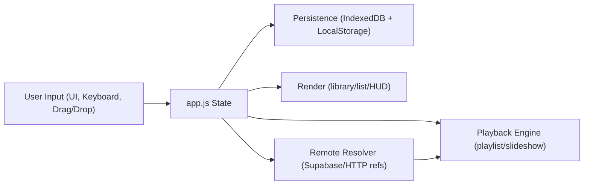

# Blend Player v5 (slideshow-playlist-player.html)

Blend is a local-first, browser-based dual-layer media studio. It lets you run a **Playlist layer** (video/audio) and a **Slideshow layer** (image/video) at the same time, then blend them live with independent controls.

> This README documents the self-contained `blend.v5.0.11 - Copy` project in this directory. Run project commands from the directory containing this file and `package.json`.
>
> The neighboring `../blend.v5.0.11/` is a separate version folder. This folder is a standalone review target. Confirm its release destination before copying changes to another version.

## Table of Contents

- [Project Description](#project-description)
- [Current Version Information](#current-version-information)
- [Screenshots](#screenshots)
- [Quick Start](#quick-start)
- [Installation](#installation)
- [Running Locally](#running-locally)
- [Feature Matrix](#feature-matrix)
- [Detailed Feature Documentation](#detailed-feature-documentation)
- [User Guide](#user-guide)
- [Playback Controls](#playback-controls)
- [Keyboard Shortcuts](#keyboard-shortcuts)
- [Touch Controls](#touch-controls)
- [Accessibility](#accessibility)
- [Mobile Usage](#mobile-usage)
- [Desktop Usage](#desktop-usage)
- [Supported File Types](#supported-file-types)
- [Import/Export Formats](#importexport-formats)
- [Configuration Reference](#configuration-reference)
- [Data Persistence, Storage, and Privacy](#data-persistence-storage-and-privacy)
- [Architecture Documentation](#architecture-documentation)
- [Browser Compatibility](#browser-compatibility)
- [What Works](#what-works)
- [Known Limitations](#known-limitations)
- [Known Issues](#known-issues)
- [Troubleshooting Guide](#troubleshooting-guide)
- [FAQ](#faq)
- [Developer Documentation](#developer-documentation)
- [Future Development and Recommended Improvements](#future-development-and-recommended-improvements)
- [Changelog Reference](#changelog-reference)
- [Contributing](#contributing)
- [Credits](#credits)
- [License](#license)

## Project Description

### What the application does

Blend combines two synchronized media layers:

- **Playlist layer**: video + audio sequence
- **Slideshow layer**: image + video sequence

You can play both at once, mix visibility using a blend slider, and control each layer volume plus a master volume.

### Primary use cases

- Event and venue playback
- DJ/VJ-style ambient media mixing
- Local/private playback sessions
- Curated “experience” packages (playlist + slideshow + settings)

### Target users

- Creators and curators
- Event operators
- Users who want local-first playback without uploading files

### Key capabilities

- Local media library with folder/file/url import
- Multi-experience catalog (save/switch/import/export experiences)
- List editing (sort, shuffle, reverse, drag reorder)
- Deep links and sharing links
- Supabase-based remote media URL resolution (public + signed private URLs)
- PWA shell with split service worker caches, offline fallback, and alias routing

### Browser-based architecture

- No framework runtime dependency
- ES modules + browser-native APIs
- IndexedDB + LocalStorage persistence
- Local-only operation for local files (network used only for configured remote features)

## Current Version Information

- **Active project root for this checkout:** this directory (`blend.v5.0.11 - Copy`)
- **Authoritative app entry:** `index.html`
- **Compatibility redirect entry:** `slideshow-playlist-player.html`
- **Runtime app version string in code/UI:** `5.0.11`
- **Cache/app shell version key:** `20261010-v5.0.11-config-diagnostics`
- **Release and version history:** see [CHANGELOG.md](CHANGELOG.md) and [VERSIONS.md](VERSIONS.md).

The web manifest and PWA icons are served from the app directory: publish `manifest.webmanifest`, `icon.svg`, and `icon-maskable.svg` alongside `index.html`. Their URLs use the shared asset version so an installed app refreshes stale manifest and icon entries after deployment.

Latest source location:

- [Repository root](https://github.com/mytech-today-now/slideshow-playlist-player.html)
- [Canonical upstream release folder](https://github.com/mytech-today-now/slideshow-playlist-player.html/tree/main/src/blend.v5.0.11)

## Screenshots

> Placeholder references (replace with real captures as available).


## Quick Start

1. Open `index.html` from a local server started in this project directory.
2. Press `C` (or click the gear icon) to open the configuration panel.
3. Add media using one of these actions:
   - `Add Files` for individual files
   - `Add Folder` for recursive folder scan
   - `Add URL` for `http(s)`, `supabase://`, or legacy `ipfs://` references
4. Select items in Media Library and add to Playlist/Slideshow.
5. In the configuration panel, press `Play` and adjust `Blend`, volume, and transitions.

## Installation

No build step is required for normal playback.

For testing and development, run these commands from this project root:

```bash
npm install
```

## Running Locally

### Option A: serve this project folder directly

```bash
npx serve -l 5173 --cors
```

Then open:

```text
http://localhost:5173/index.html
```

### Option B: serve from the parent repository root

```bash
python -m http.server 5173
```

Then open:

```text
http://localhost:5173/src/blend.v5.0.11%20-%20Copy/index.html
```

## Feature Matrix

| Area | Capability | Status | Notes |
|---|---|---|---|
| Playback | Dual-layer playback | Yes | Playlist + Slideshow layers run independently |
| Playback | Blend opacity control | Yes | Live slider + keyboard (`[` / `]`) |
| Playback | Master + per-layer volume | Yes | Playlist, Slideshow, Master |
| Playback | Experience playback modes | Yes | Loop, Stop at End, Go to Next Experience |
| Playback | Playlist order | Yes | Sequential or random; sequential by default |
| Playback | Slideshow order | Yes | Sequential or random; sequential by default |
| Playback | Fullscreen | Yes | `requestFullscreen()` on viewport |
| Library | Add files | Yes | File System Access API + input fallback |
| Library | Add folder (recursive) | Yes | Directory picker + fallback; depth limit 6; 250 supported media files per selection |
| Library | Add URL | Yes | `http(s)`, `supabase://`, legacy `ipfs://` refs |
| Library | Drag-and-drop import | Yes | Files/directories/list files |
| Library | Search/filter/sort | Yes | Type + source filters, worker projection for large sets |
| Lists | Playlist editor | Yes | Drag reorder, sort, shuffle, reverse, import/export |
| Lists | Slideshow editor | Yes | Per-image duration, per-video include-audio toggle |
| Lists | Playback timeline | Yes | Per-item start/end/duration, cumulative timing, and URL health for both layers |
| Lists | Unavailable item preservation | Yes | Experience import can keep “Not Available” placeholders |
| Persistence | IndexedDB state | Yes | Library, lists, settings, experiences, thumbnails, dir handles |
| Persistence | LocalStorage state | Yes | Active experience, banners, consent, runtime overrides |
| Import/Export | List JSON/TXT import-export | Yes | `.json`, `.jsonl`, `.txt`, `.md` import |
| Import/Export | Experience JSON import-export | Yes | Schema `player.blend.experience.v2` |
| Remote Media | Supabase URL resolution | Yes | Public object URLs + signed private URLs |
| Sharing | Deep links | Yes | `exp`, `layer`, `item`, optional `autoplay` |
| Sharing | Social share menu | Yes | Native share, copy, and platform links |
| PWA | Service worker shell cache | Yes | App shell cached; media/range requests bypass cache |

## Detailed Feature Documentation

### Slideshow Features

- Supports **images** and **videos**.
- Mixed slideshow media is supported.
- Manual navigation via viewport arrows and keyboard (`←`/`→` or `J`/`L`).
- Order can be set to **Sequential** or **Random** in Settings / Configuration; Sequential is the default.
- Per-item controls in Slideshow list:
  - Image: `displayDuration` (seconds)
  - Video: `includeAudio` toggle
- Transition system includes:
  - 17 transition effects
  - weighted effect selection
  - randomized or ordered sequencing
  - max heavy effects in a row
  - duration and overlap controls
  - optional FPS monitor + auto quality adjustment

### Playlist Features

- Supports **video** and **audio**.
- Mixed playlist media is supported.
- Playback controls: Prev / Play-Pause / Next / Stop.
- Seek 10%-90% with keys `1`-`9` (active playlist video).
- Order can be set to **Sequential** or **Random** in Settings / Configuration; Sequential is the default.
- Queue/list management:
  - shuffle, reverse, sort
  - drag reorder
  - remove item with undo toast

### Playback Timeline and Shared URL Analysis

- Every Playlist and Slideshow row shows start, end, item duration, cumulative running time, and a compact accessible SAFE / WARNING / OVER LIMIT link-health badge. Exact URL measurements remain available in the Share URL dialog and badge tooltips rather than crowding every row.
- The timelines run independently but share one playback clock. A URL checkpoint serializes every item that has started in both layers at that time, including completed items.
- The timeline summary distinguishes concurrent **session runtime** from **total media** (the sum of all image/video/audio contributions across both layers).
- URL lengths are measured from the real compact compressed share payload, not a byte estimate. Measurements are cached and scheduled incrementally so large lists remain responsive.
- Media duration is discovered from video/audio metadata during import when possible, refreshed when a local file changes, and rechecked during playback. Media with an unknown duration clearly reports unknown downstream timing until metadata becomes available. Zero-duration items are retained and serialize at their shared start checkpoint.

### Import Features

#### Images

- Drag-and-drop: Yes
- File picker: Yes
- Folder import: Yes
- Batch import: Yes
- URL import: Yes (`http(s)`, `supabase://`, legacy `ipfs://`)
- JSON import: Yes (via list/experience imports)

#### Videos

- Drag-and-drop: Yes
- File picker: Yes
- Folder import: Yes
- Batch import: Yes
- URL import: Yes (`http(s)`, `supabase://`, legacy `ipfs://`)
- JSON import: Yes

#### Audio

- Drag-and-drop: Yes
- File picker: Yes
- Folder import: Yes
- Batch import: Yes
- URL import: Yes (`http(s)`, `supabase://`, legacy `ipfs://`)
- JSON import: Yes

#### Playlists and Lists

- List import supports `.json` / `.jsonl` / `.txt` / `.md`.
- Active list target can be Playlist or Slideshow.
- Import behavior supports `Append` or `Replace current list`.
- List export supports:
  - JSON (`player.blend.list.v1`)
  - `.txt` (quoted path/reference per line)

#### Experiences

- Experience import supports `.json` (schema includes `experience` payload)
- Experience export produces timestamped JSON with settings snapshot, media library snapshot, and playlist/slideshow snapshots.
- Local list and experience imports accept files up to 10 MiB. This matches the existing shared-experience download ceiling and is about 2,200 times the checked-in 4,643-byte legacy experience fixture. JSON nesting is limited to 64 levels, any array to 10,000 items, all arrays together to 50,000 items, any object to 5,000 properties, and all objects together to 750,000 properties; text and JSONL imports allow up to 100,000 lines and 10,000 imported entries. Larger or structurally excessive files are rejected before list or experience changes; files are never silently truncated. Exports remain unchanged.

#### External Sources

Supported external reference forms:

- `https://...`
- `supabase://bucket/path/to/object`
- `bucket/path/to/object` shorthand (resolved via default bucket rules)
- legacy `ipfs://CID/...` (mapped by resolver rules)

### Import workflows (step-by-step)

#### Add Files

1. Open config panel.
2. Click `Add Files`.
3. Select media files.
4. Files appear in Media Library.

#### Add Folder

1. Open config panel.
2. Click `Add Folder`.
3. Choose a folder.
4. App recursively scans (up to configured depth) and imports supported media.

#### Add URL

1. Open config panel.
2. Click `Add URL`.
3. Paste one or more references (space/comma separated).
4. App validates and stores resolvable media references.

#### Drag-and-drop to Media Library

1. Drag files/folders from OS to Media Library grid.
2. Supported items are imported.
3. Dropped directories are scanned recursively.

#### Drag-and-drop list file into Playlist/Slideshow

1. Drag `.txt`/`.md`/`.json`/`.jsonl` file onto list editor.
2. List entries are parsed and imported into that list.
3. Missing paths can be resolved later.

#### Resolve missing paths

1. After import, click `Resolve now` or `Resolve missing paths...`.
2. Choose a folder.
3. App scans and matches missing entries by basename.

## User Guide

### Loading Media

- Use `Add Files` for one-off selection.
- Use `Add Folder` for event/session content batches.
- Use `Add URL` for remote references.
- Use source filters (`All`, `Local`, `URL`) to manage mixed libraries.

### Creating Slideshows

1. Select `Images`/`Video`/`All` in library filters as needed.
2. Multi-select media.
3. Click `Add Selected -> Slideshow`.
4. Set image durations and video `Include audio` options in the list.

### Creating Playlists

1. Select `Audio`/`Video` in library filters.
2. Multi-select media.
3. Click `Add Selected -> Playlist`.
4. Reorder/sort/shuffle as needed.

### Managing Media

- Search by filename/path.
- Sort Media Library by name/path/size/type/date/duration/metadata.
- Remove selected items from library.
- `Clear View` removes unreferenced library entries while preserving items used by saved experiences.
- `Remove Stale` deletes entries marked inaccessible.

### Saving Configurations

- Most edits are auto-saved to IndexedDB.
- Experience changes are persisted automatically.
- Active experience id is also stored in LocalStorage.

### Exporting Data

From `Export...`:

- Export list JSON
- Export list TXT
- Export media library JSON
- Export full experience JSON

### Importing Data

Remote `storageExperience` downloads accept JSON media types and are streamed with a 15-second deadline and a 10 MiB maximum. The byte limit is counted from the response body rather than trusted from `Content-Length`. This download deadline starts after URL resolution, which keeps its own signing timeout. Failed downloads keep their share URL available for retry; successful imports remove the share parameters.

- `Import List...` imports list entries into active list.
- `Experience -> Import` imports one or more experience JSON files.

### Playback Controls

- Open the configuration panel with the gear or `C` to access the playback toolbar for both layers.
- Blend slider adjusts slideshow opacity over playlist.
- Volume controls include Playlist, Slideshow, and Master (+ mute).

### Best Practices

- Keep local and remote assets separated using source filters.
- Export full experience JSON as a backup before major edits.
- For large libraries, use folder organization and list-specific curation.
- Use `Remove Stale` regularly after moving/renaming local files.

### Large Library Performance Tips

- Library/list UIs are virtualized; keep search/filter narrowed during heavy curation.
- Worker-based library projection kicks in for large collections (threshold in code: 800 items).
- Thumbnail cache is bounded; avoid rapid, repeated full-library resorting during playback.
- Split very large sets across multiple experiences for faster switching and safer backups.

### Backup Recommendations

- Regularly export Full Experience JSON and Media Library JSON.
- Keep exported files in versioned backups.

## Playback Controls

Open the configuration panel with the gear or `C` to use the playback toolbar.

| Control | Description |
|---|---|
| `Prev` | Previous item/layer progression |
| `Play/Pause` | Toggle both layers. **Pause** freezes the audio/video and the slideshow at their exact current positions; **Play** after a pause resumes both from precisely where they left off (video/audio time, image-display countdown, and Ken Burns progress are all preserved). |
| `Next` | Next item/layer progression |
| `Stop` | Fully stops both layers, resets to a blank/black screen, and rewinds to the first playlist and slideshow item. **Play** after a Stop restarts the whole experience from the beginning. |
| `Blend` | Set slideshow opacity over playlist |
| `Fullscreen` | Toggle viewport fullscreen |
| `Mute` | Toggle master mute |
| `Master Volume` | Global volume multiplier |

**Transport contract**

- `Playing → Pause → Play` = resume exactly where you left off.
- `Playing → Stop → Play` = start over at the very beginning of the playlist and slideshow.

## Keyboard Shortcuts

| Shortcut | Action |
|---|---|
| `Space` / `K` | Play/pause both layers (resumes from the exact paused position) |
| `S` | Stop — reset to black and rewind to the beginning |
| `Left` / `J` | Previous |
| `Right` / `L` | Next |
| `[` / `]` | Blend opacity -/+ 10% |
| `C` | Toggle config panel |
| `i` button | Open the Information dialog (About myTech.Today + README) from the config header |
| `F` | Toggle fullscreen |
| `M` | Toggle master mute |
| `1`-`9` | Seek 10%-90% in current playlist video |
| `/` | Focus library search |
| `Alt+S` | Open Media Library sort menu |
| `Ctrl+A` / `Cmd+A` | Select all visible Library media, or all items in the active list editor |
| `Ctrl+Click` / `Cmd+Click` | Toggle an item without clearing the current selection |
| `Shift+Click` / `Shift+Arrow` | Select a contiguous range |
| Arrow keys | Move keyboard focus through a Library or active list editor |
| `Space` (focused Library/list row) | Toggle that row’s selection |
| `Delete` / `Backspace` | Remove all selected list items, or the focused item when nothing else is selected |
| `?` | Open help modal |
| `Esc` | Clear a selection first; then close menus/modals/panel |

## Touch Controls

Implemented touch-friendly behavior:

- Large touch targets in controls and lists
- Pointer-based list reordering fallback (long-press/drag behavior)
- Dedicated selection/deletion controls remain available without modifier keys

Swipe gestures are unavailable. Use the Previous and Next buttons or keyboard arrows. Adjust blend opacity with the Blend slider.

## Accessibility

Implemented accessibility-oriented behavior includes:

- Skip link (`Skip to controls`) for keyboard users.
- ARIA labels/roles across transport, dialogs, listboxes, and status regions.
- The active Playlist and Slideshow rows expose `aria-current="true"` while their media is loaded for playback; row selection remains independent.
- Keyboard-first operation for core playback and editing workflows.
- Visible focus states and assistive announcement regions (`aria-live`).
- Reduced-motion awareness in transition manager via `prefers-reduced-motion`.

Manual screen-reader review of the current-playback row state is still outstanding. Browser automation checks the DOM semantics but does not replace a human review with a screen reader.

## Mobile Usage

- Works on modern mobile browsers for core playback and editing.
- iOS install guidance is provided through install/help banner.
- Folder/file API support varies by browser; fallback input flows are used where possible.

## Desktop Usage

- Best overall experience on Chromium browsers.
- Full File System Access APIs improve folder workflows and persistence.
- Keyboard-first workflows are fully supported.

## Supported File Types

### Image Formats

| Format | Supported | Notes |
|---|---|---|
| `.jpg` / `.jpeg` | Yes | Browser decode support required |
| `.jfif` | Yes | JPEG container variant; treated as image media |
| `.png` | Yes |  |
| `.apng` | Yes | Animated PNG decode behavior is browser-dependent |
| `.webp` | Yes |  |
| `.gif` | Yes | Animated decode behavior is browser-dependent |
| `.svg` | Yes | Rendered as image media |
| `.bmp` | Yes | Uncompressed/legacy bitmap support varies by engine |
| `.ico` | Yes | Treated as image media; icon size support varies |
| `.avif` | Yes | Browser codec support required |
| `.heic` / `.heif` | Yes | Browser codec support is inconsistent across engines |

### Video Formats

| Format | Supported | Notes |
|---|---|---|
| `.mp4` | Yes |  |
| `.m4v` | Yes | Treated as `video/mp4` |
| `.mov` / `.qt` | Yes | Explicit QuickTime MIME handling in code |
| `.mkv` | Yes | Browser codec support varies |
| `.webm` | Yes |  |
| `.ogv` | Yes |  |
| `.avi` | Yes | Browser codec support varies |

### Audio Formats

| Format | Supported | Notes |
|---|---|---|
| `.mp3` | Yes |  |
| `.m4a` | Yes |  |
| `.wav` | Yes |  |
| `.ogg` | Yes |  |
| `.flac` | Yes | Browser support varies |
| `.aac` | Yes | Browser support varies |

### Playlist/List Import Formats

| Format | Supported | Notes |
|---|---|---|
| `.json` | Yes | List/library/experience-compatible parsing paths |
| `.jsonl` | Yes | One JSON record per line |
| `.txt` | Yes | Quoted paths/URLs and delimiter parsing |
| `.md` | Yes | Markdown list parsing + path extraction |

### Configuration and Persistence Formats

| Format | Supported | Notes |
|---|---|---|
| IndexedDB object stores | Yes | Main persistent application state |
| LocalStorage key-values | Yes | UI/session flags, consent, runtime overrides |
| Runtime config JSON (`blend-runtime-config-v1`) | Yes | Operator-managed override path for Supabase/runtime settings; preserved by Clear Browser Storage |

### Export Formats

| Format | Supported | Notes |
|---|---|---|
| List JSON (`player.blend.list.v1`) | Yes | Playlist or Slideshow export |
| List TXT | Yes | Quoted path/reference lines |
| Media Library JSON (`player.blend.library.v1`) | Yes | Current sorted order exported |
| Experience JSON (`player.blend.experience.v2`) | Yes | Settings + library + both lists |

## Import/Export Formats

### List JSON (`player.blend.list.v1`)

Includes:

- `version`, `schema`, `type`
- list metadata (`name`, `description`, `createdAt`)
- project metadata (`project`, `exportedAt`)
- `order` array and `items[]`

### Library JSON (`player.blend.library.v1`)

Includes:

- sorted `items[]`
- `sort` metadata (key/dir)
- `order` array

### Experience JSON (`player.blend.experience.v2`)

Includes:

- experience metadata (`id`, `name`, `project`)
- exported settings snapshot
- library snapshot
- playlist + slideshow snapshots

Import behavior rules:

- `Append` adds items.
- `Replace current list` replaces active list, but restores previous list if nothing valid imports.
- Missing items can be resolved via folder scan.

## Configuration Reference

### Global/User Settings

| Setting | UI Control | Stored | Notes |
|---|---|---|---|
| Import behavior | `#import-behavior` | IndexedDB settings | `append` or `replace` |
| Theme | `#theme-mode` | IndexedDB settings | `auto`, `dark`, `light` |
| Effect intensity | `#effect-intensity` | IndexedDB settings | Ken Burns intensity multiplier |
| Experience playback mode | `#experience-playback-mode` | IndexedDB settings | `loop`, `stop`, `next-experience` |
| Playlist order | `#playlist-order` | IndexedDB experience settings | `sequential` (default) or `random`; Previous follows random history |
| Slideshow order | `#slideshow-order` | IndexedDB experience settings | `sequential` (default) or `random`; Previous follows random history |
| Loop experience catalog | `#loop-experience-catalog` | IndexedDB settings | Wrap to first experience |
| Default image duration | `#default-duration` | IndexedDB settings | Seconds |
| Transition duration | `#transition-duration` | IndexedDB settings | 200-10000 ms |
| Transition overlap | `#transition-overlap` | IndexedDB settings | 0-10000 ms |
| Transition randomize order | `#transition-randomize-order` | IndexedDB settings | Weighted random vs ordered |
| Max heavy transitions in row | `#transition-max-heavy` | IndexedDB settings | 0-8 |
| Enabled transitions + weights | Transition picker | IndexedDB settings | Per-effect enable + weight |
| Auto quality adjust | `#quality-auto-adjust` | IndexedDB settings | FPS-driven quality tier |
| Show FPS monitor | `#show-transition-fps` | IndexedDB settings | HUD monitor |
| Resume on load | `#resume-on-load` | IndexedDB settings | Explicit opt-in restores saved positions paused; select Play to start media |
| Auto verify on startup | `#auto-verify` | IndexedDB settings | Verifies file handles |
| Analytics consent | `#analytics-consent` | LocalStorage + runtime | Also gated by browser privacy signals |
| Supabase default bucket | `#supabase-default-bucket` | IndexedDB settings | Default storage bucket |
| Signed URL TTL | `#supabase-signed-url-ttl` | IndexedDB settings | Seconds |
| Require auth for private media | `#private-media-auth-required` | IndexedDB settings | Controls auth expectation |
| Playlist volume | `#vol-playlist` | IndexedDB settings | 0.0-1.0 |
| Slideshow volume | `#vol-slideshow` | IndexedDB settings | 0.0-1.0 |
| Master volume | `#vol-master` | IndexedDB settings | 0.0-1.0 |

Random chooses among playable items and excludes the current item when another playable choice exists; a one-item playable list stays on that item. Previous returns through recorded random navigation history for each layer.

Older experience exports that omit either layer order setting load as Sequential. Unknown values also normalize to Sequential.

## Data Persistence, Storage, and Privacy

### IndexedDB stores

Database: `player-blend-v1` (version `5`)

Stores:

- `library`
- `playlist`
- `slideshow`
- `settings`
- `experiences`
- `thumbnails`
- `dirHandles`
- `aliases`
- `aliasMeta`

When the stored database version is newer than this app's requested version, Blend opens it without requesting a downgrade and checks the required object stores and key paths before startup. Compatible additive schemas remain usable; an incompatible schema stops startup and leaves the saved database unchanged.

### LocalStorage keys used

- `blend-active-experience-id`
- `blend-install-banner-hidden-v4`
- `blend-welcome-v4`
- `blend-analytics-consent-v1`
- `blend-share-mastodon-instance-v1`
- `blend-runtime-config-v1` (operator-managed connection settings; preserved by Clear Browser Storage)
- `blend-supabase-auth-session-v2` (only after opting in to save the session)
- `blend-debug-log-v1`

### Privacy and security notes

- Local media files are not uploaded by default.
- Browser-side path sanitization rejects control chars and `..` traversal.
- Remote references are validated and normalized.
- Supabase sessions stay in memory by default. Selecting **Save session in this browser** explicitly saves only `access_token`, `refresh_token`, and `expires_at` under `blend-supabase-auth-session-v2`; the previous `v1` entry is removed and never restored. The accessible disclosure says: “A saved token can be read by scripts running on this site.”
- Supabase refresh tokens have no fixed expiry and are normally single-use, with a default 10-second reuse interval. Project Auth settings can still end sessions through inactivity or maximum-lifetime rules, and sign-out revokes the session. See [Supabase session documentation](https://supabase.com/docs/guides/auth/sessions).
- To restore cross-reload access for a session, select **Save session in this browser** when connecting; that checkbox is the explicit acceptance of the LocalStorage disclosure. To return to tab-only access, sign out and reconnect with the checkbox cleared.
- Manual fresh-profile check: in a new browser profile, confirm no Supabase session key exists; connect synthetic access and refresh tokens with the checkbox cleared; verify neither token is saved, reload, and confirm private media remains gated while public/local playback still works. Then repeat with the checkbox selected, confirm only the documented fields are saved, and sign out to clear them. Keyboard to the checkbox and confirm its adjacent disclosure is announced by a screen reader without hover.
- Threat assumption: any script executing on this site can read an opted-in LocalStorage session. This describes the browser boundary and does not claim that this checkout contains an injection.
- Google Analytics script is included in `index.html`; event tracking is controlled by consent + privacy signals.

### Browser permissions

- Local file playback can require browser-granted read permission for stored file handles.
- On startup, auto-verify can mark entries as stale when handle access is no longer granted.
- Supabase private media access requires a valid API token/session in this tab or an explicitly saved session in this browser profile.

### Offline behavior

- Service worker caches the shell, static assets, docs, API/config responses, and alias metadata in separate versioned cache namespaces.
- Alias rules are stored durably in IndexedDB and mirrored into the service worker for offline-friendly friendly/legacy routes.
- Media and HTTP `Range` requests bypass Cache Storage and go to network/local handles.
- Remote media URLs still require connectivity unless a future explicit offline-media pack is added.

### Reset and cache management

Use **Clear Browser Storage** to remove browser-side data:

- IndexedDB data, including saved media access handles
- selected LocalStorage keys, including saved Supabase sessions and any legacy session entry
- operator-managed runtime configuration (`blend-runtime-config-v1`) is retained, including Supabase endpoint, key, and bucket overrides, so configured service access can be restored after reset
- Blend service worker/cache entries across `blend-shell-*`, `blend-static-*`, `blend-docs-*`, `blend-api-*`, and `blend-alias-*`

Media files on disk are not deleted, and reset does not send a remote logout request. Before changing the saved local Supabase session or deleting IndexedDB, reset prepares a recovery snapshot of every database store except `thumbnails`. Thumbnail Blobs are derived previews; they are generated lazily from retained media handles, while unavailable sources use the existing media icon. Excluding this cache keeps the snapshot's thumbnail record and Blob-byte counts at zero, even for a large cache. Snapshot memory still scales with the user-authored records it protects.

If the recovery snapshot cannot be prepared, deletion does not begin and the current Blend state, saved data, and local Supabase session remain unchanged. The user sees: “Browser reset could not create a recovery copy. Your saved Blend data was kept; close other Blend tabs and retry.” After a snapshot succeeds, the local Supabase session is cleared and IndexedDB deletion begins. The in-memory screen is committed only after IndexedDB confirms deletion. If deletion fails or times out, the session is reported as removed and recovery of saved records is attempted before retry. A timed-out deletion may remove the database before recovery finishes, so the thumbnail cache may be empty afterward; the incomplete-reset message explicitly says the cache may be cleared. Previews can regenerate from retained handles when available. This is cache cleanup, not media-file loss, and the reset reports an incomplete outcome rather than success. The runtime configuration override is connection configuration rather than resettable player data, so the confirmation identifies it as preserved. If session storage cannot be fully cleared, Blend signs out in the current tab, reports that removal of all saved session data could not be confirmed, and keeps the other Blend data. A success message appears only after the requested local cleanup steps finish.

## Architecture Documentation

### Front-end architecture

- HTML shell (`index.html`) + CSS (`styles.css`) + JS modules.
- Main orchestration in `app.js`.
- Feature modules:
- `transition-manager.js`
- `storage-url-resolver.js`
- `supabase-auth.js`
- `supabase-config.js`
- `drag-sort.js`
- `timeline-analysis.js`
- `logger.js`
- `pwa-config.js`
- `pwa-client.js`
- `alias-router.js`
- `alias-store.js`
- `alias-sync.js`

### Data flow



### State management

Single in-memory `state` object manages:

- library map + directory handles
- playlist/slideshow arrays
- list metadata
- settings
- experience catalog + active experience
- runtime playback position and history

### Event handling

- UI event handlers wired in `wireTransport`, `wireConfig`, `wireKeyboard`.
- Drag-and-drop supports internal reorder plus external files/directories/list imports.
- Playback completion handler coordinates end-of-experience behavior.

### Browser Technologies and APIs

| API / Technology | Usage |
|---|---|
| HTML5 / CSS3 / JS (ES Modules) | Core UI and application logic |
| IndexedDB | Persistent app data and thumbnails |
| LocalStorage | UI/session flags, consent, auth/session, runtime config |
| File System Access API | File and directory pickers, persistent handles |
| File input fallback | Browser fallback when File System Access unavailable |
| Drag and Drop API | OS file/folder drops and list imports |
| Media APIs (video elements, image elements, and media events) | Playback and slideshow rendering |
| Fullscreen API | Viewport fullscreen |
| Service Worker + Cache Storage | App shell caching |
| Web Share API | Native share sheet |
| Clipboard API | Copy link fallback |
| URL/History APIs | Deep links and cleaned auth hash |
| Web Animations API + CSS capabilities | Transition effects |
| `requestAnimationFrame` | Ken Burns and monitoring loops |
| `matchMedia` | Theme/reduced-motion and install logic |

### Dependencies

Runtime:

- No front-end framework dependency required for core app logic.
- External script in `index.html`:
- Google gtag script (`googletagmanager.com`) for analytics integration.

Remote services (optional/by configuration):

- Supabase Auth endpoints
- Supabase Storage public/signed URL endpoints

Dev/test (`package.json` in this project root):

- `@playwright/test`
- `esbuild`

## Browser Compatibility

| Browser | Support statement | Automated evidence | Limits |
|---|---|---|---|
| Chrome (desktop) | Primary desktop target | Full E2E suite is configured for Playwright Chromium | The Chromium project is not a run of Google's branded Chrome build; the last 189-test full run, before the added auth-failure smoke case, had 171 passes and 18 failures outside the compatibility smoke spec. |
| Edge (desktop) | Chromium-family behavior is expected | No branded Edge run | Edge-specific behavior is not independently verified. |
| Firefox (desktop) | Partial | Focused Playwright Firefox compatibility smoke | File-input fallback is covered; this does not certify every Firefox release or platform. |
| Safari (desktop) | Partial | Focused Playwright WebKit compatibility smoke | WebKit engine coverage is not a run of the Safari application; fallback import save failures are announced as session-only. |
| iOS Safari | Partial | No iOS or mobile Safari run | Install guidance is provided; mobile picker, fullscreen, and PWA behavior remain unverified. |
| Android Chrome | Partial | No Android device run | Desktop Chromium results do not verify Android-specific behavior. |

Compatibility notes:

- CI runs the full suite in Chromium and focused fallback, accessibility, viewport, and service-worker shell smoke checks in Playwright Firefox and WebKit. Each compatibility result records the Playwright project and runtime engine version in the HTML report.
- The last full-suite HTML report, before the added auth-failure smoke case, recorded all 24 compatibility cases passing (8 per project) and 18 failures in other Chromium tests (171 passed out of 189). The current focused HTML report passes 27/27 cases (9 per project) and records Chromium 153.0.8010.12, Firefox 155.0, and WebKit 26.6; every result attaches its project and runtime version.
- These results describe Playwright browser-engine builds. They do not establish branded Chrome, Edge, Firefox, or Safari application coverage, or mobile-device coverage.
- File-input fallback imports remain available in memory if browser storage rejects the selected file data. Blend reports that outcome as session-only and the files must be selected again after reload; it does not report a successful save.
- Actual media decode depends on browser codec support.
- HEIC/HEIF and some MKV/AVI/FLAC/AAC combinations may vary by browser/platform.

## What Works

Verified in current implementation:

- Dual-layer playback with blend and volume control.
- Experience create/rename/delete/import/export lifecycle.
- Media library add (files, folders, URLs), drag/drop, search/filter/sort.
- Playlist/slideshow editing (add, remove, reorder, sort, shuffle, reverse).
- Sequential or random playback order per layer, with sequential defaults and history-aware Previous navigation.
- List and experience import/export flows with validation and recovery UI.
- Supabase token auth modal/session handling.
- Remote media resolution for `http(s)` + `supabase://` + legacy `ipfs://` mapping.
- When explicitly enabled, Resume on load restores saved positions paused and waits for Play, so startup never starts audio unexpectedly.
- Deep-link loading (`exp`, `layer`, `item`, `autoplay`).
- Service worker install and app shell caching.

## Known Limitations

- Folder scanning depth is capped (`MAX_FOLDER_DEPTH = 6`). A scan that reaches this limit reports how many child folders it skipped as a partial result; choose **Choose deeper folder** in the status notice (or select the deeper folder directly) to include that media.
- Each folder selection imports at most 250 supported media files (`MAX_FOLDER_MEDIA_FILES` in `app.js`). If more accessible files are found, the saved items stay in the library and the status notice reports added, skipped, and pending counts; choose **Choose smaller folder** to continue with a narrower folder or another folder. This limit applies to both directory-picking and directory-input fallback imports.
- Remote URL parsing generally requires media-like filenames/extensions for text list imports.
- Service worker intentionally does not cache media/range responses.
- File System Access capabilities vary significantly by browser.

## Known Issues

- A parent-repository helper script may still reference legacy paths; serve this project folder and open its local `index.html` instead.
- The parent repository's `VERSION` and README may not match this app's runtime version. Use this project's package and PWA configuration for its local version facts.

## Troubleshooting Guide

| Symptom | Likely Cause | What to Do |
|---|---|---|
| Item shows `Not Available` | Missing local file or inaccessible remote reference | Use `Resolve links` and/or re-add source folder/URL |
| Imported list adds 0 items | Unsupported format or no valid media paths | Verify extensions and path syntax; check toast details |
| Remote media fails to load | Auth required or invalid storage reference | Connect Supabase token, verify bucket/path, retry |
| Remote media returns a transient `5xx` / `521` error | The upstream host or edge service is temporarily unavailable | Blend retries once, skips the item without marking it stale, then shows **Temporarily unavailable** with a **Retry** button |
| Playback stops unexpectedly | End-of-list behavior + mode | Check `Experience playback mode` and list contents |
| Folder import finds too little media | Nested depth beyond limit or unsupported extensions | Import from a closer root or add files directly |
| Large library feels heavy | Thumbnail/projection load | Use search/filter/source pills; split across experiences |
| Share popup blocked | Browser popup policy | Use `Copy share link` fallback |

### Error Recovery Procedures

- Use `Resolve links` for unresolved refs.
- A transient remote outage keeps the item in its list and offers **Retry now**; it is not treated as a missing local file.
- Use `Remove Stale` to clean inaccessible files.
- Re-import exported JSON backups if list state is damaged.
- Use `Clear Browser Storage` for full local reset.

## FAQ

### Does Blend upload my local files?

No, local files are played from browser handles and browser storage metadata. Remote URLs are fetched when you explicitly add/use them.

### Can I run fully offline?

App shell can work offline after caching. Remote media and remote experience URLs still require network.

### How do I move a setup between machines?

Export Full Experience JSON (and optionally Media Library JSON), then import on the other machine. Re-link local paths as needed.

### Why does a file import but not play?

Container extension can be recognized while codec decode fails in your browser. Try a browser/codec-compatible format.

### Is there a reset button?

Yes, `Clear Browser Storage` in the Experience row resets browser data without touching disk files.

### Can I share a specific item and position?

Yes. Deep links include `exp`, optional `layer`, optional `item`, and optional `autoplay`.

### Can I use private Supabase media?

Blend requests signed URLs with the signed-in user's access token. Whether that user may read an object is controlled by the Supabase project's Storage policies, which this app does not configure or verify. While the provider release gate is unverified, **Share URL is blocked for experiences that reference a non-allowlisted private bucket**; public-only sharing and normal playback remain available. Complete the [staging Storage policy matrix](STORAGE_POLICY_VERIFICATION.md), have the policy owner review the redacted policy and rollback exports, and record all six principal/object outcomes before authorizing a later release change for private-reference sharing.

### Are IPFS features still active?

Legacy IPFS-compatible reference handling is supported through resolver mapping, but dedicated IPFS module imports are not in the active runtime path for this version.

## Developer Documentation

### Project Structure

```text
.
  index.html
  slideshow-playlist-player.html
  styles.css
  app.js
  pwa-config.js
  pwa-client.js
  alias-router.js
  alias-store.js
  alias-sync.js
  alias-manifest.json
  offline.html
  transition-manager.js
  storage-url-resolver.js
  supabase-auth.js
  supabase-config.js
  drag-sort.js
  logger.js
  service-worker.js
  sw.js
  manifest.json
  manifest.webmanifest
  tests/
    regression/
    e2e/
  samples/
  dist/
```

### Code Organization

- `app.js`: app state, UI wiring, import/export, playback, persistence
- `pwa-config.js`: app/cache/database version constants, precache assets, and cache policy metadata
- `pwa-client.js`: service worker registration, update prompts, cache messages, and alias snapshot sync
- `alias-router.js`: pure alias validation and route resolution logic
- `alias-store.js`: IndexedDB-backed alias persistence and manifest guards
- `alias-sync.js`: alias manifest fetch/apply and worker snapshot messaging
- `transition-manager.js`: transition effect engine + quality heuristics
- `storage-url-resolver.js`: media reference normalization + public/signed URL resolution
- `supabase-auth.js`: Supabase session lifecycle and token flows
- `STORAGE_POLICY_VERIFICATION.md`: provider-owned private Storage release gate and opt-in staging matrix
- `drag-sort.js`: pointer reorder fallback for virtualized list rows
- `logger.js`: structured logging + optional local persistence

### Extension Points

- `window.Blend` exposes debug/integration helpers (switch experience, export/import, share helpers, state access).
- Share platform registry supports additional platforms via `registerSharePlatform`.
- Runtime configuration can be overridden via `BLEND_RUNTIME_CONFIG`, `__BLEND_RUNTIME_CONFIG__`, or LocalStorage runtime config key.

### Customization

- Adjust default Supabase/runtime values in `supabase-config.js` placeholders.
- Tune transition defaults in `transition-manager.js` / default settings.
- Customize style/theme behavior in `styles.css` and theme mode logic.

### Validation and Tests

From this project root, the directory containing `package.json`:

```bash
npm run check
npm run test:regression
npm run test:regression:isolated
npm run test:e2e
npm run test
```

`npm run test:regression` runs all Node tests serially in the current process and requires Node 22.8 or later. This avoids Node's default per-file child processes in restricted Windows runners. `npm run test:regression:isolated` keeps the default process isolation for environments that allow child processes and is used by CI. Playwright Test always requires a worker process and also launches a browser process. If `npm run test:e2e` reports `spawn EPERM` inside a restricted coding-agent sandbox, run it from a normal Windows PowerShell session or another environment where child-process creation is allowed. Limiting Playwright to one worker reduces concurrency but does not remove its worker process requirement.

## Future Development and Recommended Improvements

1. Add optional codec diagnostics in UI for failed media loads.
2. Add first-class screenshot assets and GIF demos to documentation.
3. Update parent-repository helper scripts and root version metadata to match the app's current conventions.

## Changelog Reference

- [CHANGELOG.md](CHANGELOG.md) records the documented Blend v5 changes and identifies version snapshots without separate release notes.
- [VERSIONS.md](VERSIONS.md) lists the available version folders and the verified app, cache, and database version values.

## Contributing

Please prioritize:

- Local-first behavior
- Import/export compatibility
- Browser-API graceful fallback behavior
- Defensive error handling around file access, parsing, playback, and remote URL resolution
- Regression tests for any change in persistence, import/export, or playback behavior

Suggested workflow:

1. Work in this project directory.
2. Run regression tests.
3. Run targeted e2e scenarios for changed workflows.
4. Validate import/export roundtrips with real sample media.

## Credits

- Project lineage references an earlier player concept from [`pseudosavant/player.html`](https://github.com/pseudosavant/player.html).
- Fork/reference snapshot preserved at `../player.original/player.html`.

## License

MIT License. See [`LICENSE`](LICENSE).
