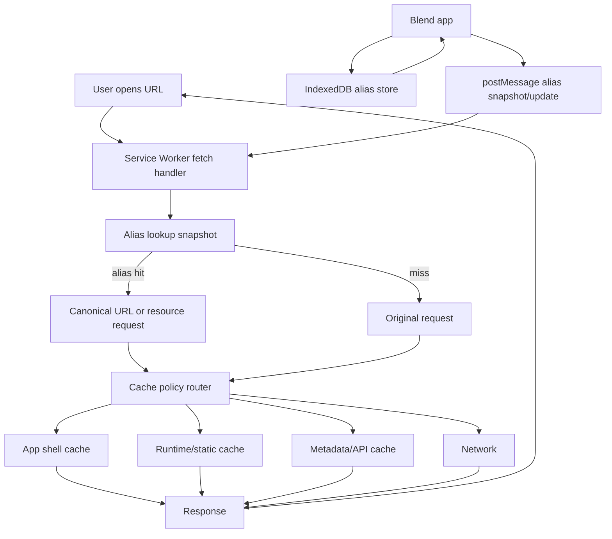
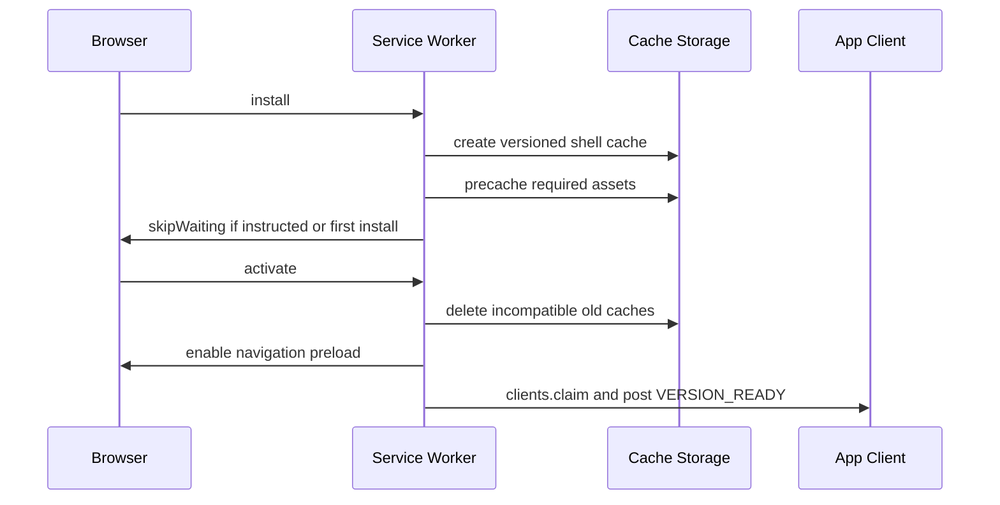

# Option 4 PWA-Heavy Implementation Plan

## 1. Current Architecture Assessment

### Assumptions

- "Option 4" means the existing app keeps the current static, local-first architecture and adds a production service worker layer plus offline alias resolution.
- "Option 2" is treated as the baseline cache-aware static app: versioned assets, manifest metadata, installability, and refactored static asset loading.
- The active implementation folder is this versioned app folder. The app should be refactored in place and later copied forward as a release folder if the repository keeps its current version-per-folder model.
- Normal playback must continue to work with no runtime framework and no required build step.
- Local media and HTTP range requests should continue to bypass Cache Storage unless a future explicit media-download feature is added.

### Current Architecture

- `index.html` is the application shell and includes the manifest plus versioned CSS.
- `app.js` is the main orchestrator for state, UI wiring, playback, import/export, IndexedDB persistence, localStorage flags, PWA registration, and reset behavior.
- Focused modules already exist for URL sharing, storage URL resolution, Supabase auth/config, logging, markdown rendering, transitions, drag sorting, and playback timing.
- IndexedDB `player-blend-v1` version 4 stores `library`, `playlist`, `slideshow`, `settings`, `experiences`, `thumbnails`, and `dirHandles`.
- `service-worker.js` currently performs app-shell precaching, runtime same-origin caching, navigation fallback, versioned cache cleanup, and media/range bypass.
- `sw.js` is a compatibility shim that imports `service-worker.js`.
- `manifest.json` and `manifest.webmanifest` exist, but the HTML currently links `manifest.json`.
- Existing tests cover pure modules with `node:test` and browser workflows with Playwright.

### Limitations

- Service worker versioning is manually duplicated across `app.js`, `service-worker.js`, HTML query strings, and manifests.
- There is one cache name for app shell and runtime entries, which makes cleanup, diagnostics, expiration, and rollback harder.
- Cache strategies are destination-light: HTML uses network-first, most static assets behave as stale-while-revalidate, and there is no route-specific policy table.
- Failed precache during `install` can prevent activation because all shell assets are added as one `cache.addAll()` batch.
- The service worker has no alias registry, alias lookup, alias manifest synchronization, or alias invalidation.
- Runtime cache writes do not enforce size, count, age, or storage-pressure limits.
- There is no explicit offline fallback document, offline data health UI, cache status UI, or update-ready UI beyond install banner behavior.
- Navigation preload, message commands, update notifications, and cache diagnostics are not implemented.
- There is no test suite dedicated to service worker routing, cache policies, alias migration, or offline behavior.

### Technical Debt

- Version drift is visible: package, app constants, HTML metadata, manifest names, and service worker cache keys are not all aligned.
- `app.js` is a large browser-only orchestrator. New PWA logic should be added as small importable modules instead of increasing `app.js` further.
- README and code comments still contain stale active-folder and version references.
- Reset logic deletes Blend caches broadly but does not know about separate app-shell, runtime, alias, and metadata caches yet.

### Opportunities

- Keep the app zero-framework while extracting PWA concerns into small, testable modules.
- Make aliases first-class data in IndexedDB and expose a small read-only snapshot to the service worker.
- Split caches by responsibility: shell, static runtime, documents, metadata, aliases, and optional API responses.
- Add deterministic cache manifests and version metadata so releases and rollbacks are safer.
- Improve perceived performance with instant shell load, stale-while-revalidate static assets, navigation preload, and app-controlled update prompts.

## 2. Target Architecture

### Summary

The target architecture keeps Blend as a static ES-module app and adds a PWA platform layer around it:

- A service worker routes requests using a declarative cache policy table.
- An alias registry persists configurable alias rules in IndexedDB.
- The app owns alias editing, validation, synchronization, migration, diagnostics, and user-facing update prompts.
- The service worker owns fast request handling, offline fallback, cache cleanup, alias route resolution, and app-shell availability.
- Build-time or release-time metadata generates a single source of truth for app version, cache version, precache assets, and alias table version.

### Component Responsibilities

| Component | Responsibility |
|---|---|
| `index.html` | Minimal shell, manifest link, boot script, update/offline UI anchors |
| `app.js` | Existing app orchestration; delegates PWA and alias behavior to modules |
| `pwa-config.js` | Shared app/cache/version constants and route policy metadata |
| `pwa-client.js` | Service worker registration, messages, update prompts, cache status UI integration |
| `service-worker.js` | Install, activate, fetch routing, alias resolution, cache lifecycle, offline fallback |
| `alias-store.js` | IndexedDB-backed alias CRUD, validation, migration, versioning |
| `alias-router.js` | Pure alias matching and canonicalization logic used by tests and app code |
| `alias-manifest.json` | Optional shipped alias seed/snapshot |
| Cache Storage | HTTP response storage by cache class |
| IndexedDB | Durable app data, alias registry, sync metadata, thumbnails, local handles |
| LocalStorage | Small UI/session flags only; not alias source of truth |

### Interaction Diagram



### Request Lifecycle

1. Browser sends a GET request.
2. Service worker ignores unsupported methods, cross-origin requests without an explicit policy, media range requests, and unsafe schemes.
3. For navigations and same-origin static resources, service worker normalizes the URL.
4. Alias snapshot is checked using exact, normalized-path, and optional pattern rules.
5. The resolved canonical URL is evaluated by the cache policy router.
6. The selected strategy returns a response from cache, network, or fallback.
7. Successful network responses are cached only if status, type, headers, size, and policy allow it.
8. The app receives optional telemetry messages for alias hits, update readiness, offline fallback, or cache errors.

### Cache Lifecycle



### Offline Lifecycle

1. First visit online: install service worker, cache the shell, seed aliases, open IndexedDB, and optionally warm metadata.
2. Later offline visit: serve `index.html` from shell cache; resolve alias navigations to canonical cached routes; show remote media as unavailable if not local or explicitly cached.
3. Stale data exists: display cached app shell and cached metadata with stale markers; refresh in background when connectivity returns.
4. Reconnect: app asks service worker to refresh alias manifests, metadata, and selected runtime assets.
5. Storage pressure: app and service worker trim nonessential runtime caches before alias metadata or app shell.

### Update Lifecycle

1. New deployment changes `APP_VERSION`, `CACHE_VERSION`, and the precache manifest.
2. Browser discovers a new service worker.
3. New worker installs into a new shell cache without deleting the current live cache.
4. App receives `UPDATE_AVAILABLE`.
5. User can apply now, or the app applies on next launch.
6. On activation, the new worker deletes only known old Blend caches outside the retention window.
7. If activation or migration fails, the old app continues until reload or rollback deployment.

## 3. Required File Changes

### Create

| File | Purpose | Dependencies | Implementation Notes |
|---|---|---|---|
| `pwa-config.js` | Single source for app version, cache names, precache list, cache policies | None | Export constants consumable by app modules and tests; service worker can import via `importScripts` if kept classic, or migrate worker to module type if browser targets allow it |
| `pwa-client.js` | Register/update service worker and handle messages | `logger.js`, `pwa-config.js` | Move `setupPWA()` registration/update logic out of `app.js`; expose `registerPwa`, `refreshCaches`, `applyUpdate`, `getPwaStatus` |
| `alias-store.js` | IndexedDB alias persistence and migration | Existing DB helpers or a small shared IDB helper | Add alias object store through `DB_VERSION` bump; validate schema before writes |
| `alias-router.js` | Pure alias matching and normalization | None | DOM-free and regression tested; supports exact, prefix, regex-like safe patterns if needed |
| `alias-sync.js` | Fetch, validate, diff, and apply alias manifests | `alias-store.js`, `alias-router.js` | Network-first with ETag/version checks; never applies invalid manifests |
| `alias-manifest.json` | Seeded alias table for friendly/legacy routes | Generated or hand-maintained | Contains only safe same-origin canonical targets unless explicitly allow-listed |
| `offline.html` | Minimal offline fallback for unrecoverable navigation misses | `styles.css` optional | Should be tiny, static, and precached |
| `tests/regression/alias-router.test.mjs` | Alias matching unit tests | `alias-router.js` | Cover exact, query/hash preservation, loops, disabled/expired aliases |
| `tests/regression/alias-store.test.mjs` | Alias validation/migration tests | `alias-store.js` | Use fake IndexedDB shim or test validation separately if no dependency is desired |
| `tests/regression/pwa-config.test.mjs` | Version and precache invariant tests | `pwa-config.js` | Prevent version/cache drift |
| `tests/e2e/pwa-offline.e2e.spec.mjs` | Install, reload offline, fallback, update UI | Fixture server | Use browser context offline mode |
| `tests/e2e/alias-routing.e2e.spec.mjs` | Friendly URL and cached alias behavior | Fixture server | Verify online and offline alias navigations |

### Modify

| File | Purpose | Implementation Notes |
|---|---|---|
| `app.js` | Delegate PWA setup; open upgraded DB; integrate alias diagnostics/settings | Replace inline `setupPWA()` registration with `pwa-client.js`; bump `DB_VERSION`; add alias store initialization after DB open |
| `service-worker.js` | Production route/caching/alias worker | Split caches, add policy router, alias snapshot, messages, navigation preload, robust install, quota handling |
| `sw.js` | Compatibility shim | Keep as import shim for old registrations; optionally post deprecation note in comments |
| `index.html` | Manifest, preload hints, offline/update UI hooks | Link `manifest.webmanifest`; add app module version from `pwa-config.js` process or keep metadata synced by test |
| `manifest.json` | Compatibility manifest | Either mirror `manifest.webmanifest` or redirect usage to `.webmanifest` while keeping this file for legacy installs |
| `manifest.webmanifest` | Primary manifest | Align version/name/start_url/icons; consider PNG icons for broader install compatibility |
| `README.md` | Document PWA and alias behavior | Add cache strategy, alias config, reset, deployment, testing |
| `CLAUDE.md` | Developer guidance | Update active folder/version notes and add PWA/alias module guidance |
| `package.json` | Test scripts | Add service worker syntax checks, alias regression tests, optional Lighthouse/manual PWA script |
| `tests/e2e/fixture-server.mjs` | Test HTTP behavior | Add headers for Cache-Control, ETag, alias manifests, offline fallback, and redirect fixtures |

### Rename or Reorganize

| Current | Target | Rationale |
|---|---|---|
| Inline PWA code in `app.js` | `pwa-client.js` | Keeps `app.js` from growing and makes service worker client behavior testable |
| Ad hoc version constants | `pwa-config.js` plus release checklist | Reduces version drift |
| One cache namespace | `blend-shell-*`, `blend-static-*`, `blend-docs-*`, `blend-api-*`, `blend-alias-*` | Enables targeted cleanup and quota trimming |

### Remove

| File/Code | Timing | Rationale |
|---|---|---|
| None initially | N/A | Preserve backward compatibility |
| Old cache names | During activation after retention window | Avoid stale shell conflicts |
| `sw.js` shim | Future major release only | Existing users may still have old registrations |

## 4. Service Worker Design

### Worker Mode

Keep `service-worker.js` as a classic worker initially because `sw.js` already uses `importScripts`. If migrating to module service workers later, ship it as a separate release with explicit Safari validation.

### Cache Names

Use separate versioned caches:

```js
const APP_VERSION = '5.0.11';
const CACHE_VERSION = '20260710-option4';
const CACHE_NAMES = {
  shell: `blend-shell-${CACHE_VERSION}`,
  static: `blend-static-${CACHE_VERSION}`,
  docs: `blend-docs-${CACHE_VERSION}`,
  api: `blend-api-${CACHE_VERSION}`,
  aliases: `blend-alias-${CACHE_VERSION}`
};
```

### Install Event

- Precache critical shell assets: `index.html`, stylesheet, active modules, manifest, icons, `offline.html`, alias seed.
- Use individual `cache.add()` calls with required/optional classification.
- Fail install only when required assets fail.
- Cache optional docs like `README.md` separately.
- Call `self.skipWaiting()` only when first install or after an app message requests immediate update. For aggressive enterprise rollout, make this configurable.

### Activate Event

- `clients.claim()` after migration/cleanup succeeds.
- Enable navigation preload when available.
- Delete known old Blend caches except the currently active version and optionally one rollback version.
- Load the latest alias snapshot from Cache Storage or an app-provided message.
- Notify clients with `{ type: 'PWA_ACTIVATED', appVersion, cacheVersion }`.

### Fetch Handler

Policy order:

1. Ignore non-GET.
2. Ignore unsupported protocols.
3. Bypass media range requests.
4. Bypass large audio/video streaming unless explicitly configured for offline download.
5. Resolve same-origin aliases for navigations and allowed static resources.
6. Route by request destination/path policy.
7. Return policy response or fallback.

### Message Handling

Support these commands:

| Message | Direction | Purpose |
|---|---|---|
| `SKIP_WAITING` | App to worker | Apply waiting worker |
| `GET_VERSION` | App to worker | Return worker/app/cache versions |
| `REFRESH_ALIAS_SNAPSHOT` | App to worker | Replace in-memory alias table with validated snapshot |
| `CLEAR_RUNTIME_CACHES` | App to worker | Clear non-shell caches from reset UI |
| `WARM_URLS` | App to worker | Pre-cache small metadata/doc resources |
| `CACHE_STATUS` | App to worker | Return cache names, approximate entries, alias version |
| `ALIAS_HIT` | Worker to app | Optional diagnostics |
| `OFFLINE_FALLBACK_USED` | Worker to app | Optional status banner |
| `UPDATE_AVAILABLE` | App registration flow | User-facing update prompt |

### Runtime Caching

- Cache only `GET` responses with status 200, or opaque responses only for explicit allow-listed origins.
- Do not cache responses with `Cache-Control: no-store`.
- Do not cache signed private media URLs.
- Do not cache `Authorization` requests unless a policy explicitly permits it.
- Enforce per-cache max entries and age.
- Trim runtime caches during quota errors.

### Navigation Fallback

- Online: network-first for navigations, with navigation preload response preferred when available.
- Offline: alias route -> cached canonical navigation -> cached `index.html` -> `offline.html`.
- Do not mask 404s online for static missing assets; only app navigations should fall back.

### Background Synchronization

- Use Background Sync only for noncritical metadata/alias refresh requests.
- Do not rely on Background Sync for core correctness because Safari/iOS support is limited.
- Fallback to refresh on app startup, visibility change, and online event.

### Error Recovery

- If precache partially fails, activate only with required shell assets.
- If cache writes throw quota errors, delete runtime caches and retry once.
- If alias snapshot is invalid, keep the last known-good snapshot.
- If the worker is corrupt or mismatched, reset UI should unregister workers and clear Blend caches.

## 5. Cache Strategy

| Resource | Strategy | Rationale |
|---|---|---|
| HTML navigations | Network First with offline fallback | Keeps shell fresh while preserving offline startup |
| `index.html` shell fallback | Precache + Cache First fallback | Required for instant repeat load |
| CSS | Stale While Revalidate | Fast paint; versioned URLs avoid stale long-term assets |
| JS modules | Stale While Revalidate for versioned URLs; Network First for unversioned | Fast boot with release safety |
| Service worker | Network Only by browser default | Browser update algorithm should control it |
| Manifests | Stale While Revalidate | Install metadata can refresh without blocking app |
| SVG icons | Cache First with version cleanup | Small stable assets |
| PNG icons/screenshots | Cache First | Stable install assets |
| Fonts | Cache First with long max-age | Font files are immutable when fingerprinted |
| Images used by UI | Cache First or SWR | Small, stable art assets |
| User/local media | Network Only / local handle only | Avoid storage blowups and range bugs |
| Remote media | Network Only by default | Large files, signed URLs, range requests, and quota risk |
| Videos/audio | Network Only; bypass range | Required for streaming correctness |
| README/docs | Stale While Revalidate | Useful offline; not critical for boot |
| JSON app config | Network First with cached fallback | Config should update but remain available offline |
| APIs requiring auth | Network Only or short Network First if explicitly safe | Avoid leaking private data into broad caches |
| Supabase signed URLs | Network Only | Signed URLs expire and may expose private access |
| Alias manifest | Network First with last-known-good fallback | Aliases need sync but must work offline |
| Alias snapshot | IndexedDB source + worker memory/cache mirror | Fast worker lookup and durable app-managed versioning |
| Search indexes/metadata | Stale While Revalidate | Offline-friendly and refreshable |

### Strategy Comparison

| Strategy | Best For | Avoid For |
|---|---|---|
| Cache First | Immutable icons/fonts/assets | HTML and mutable config |
| Network First | HTML, alias manifest, config | Slow networks without timeout |
| Stale While Revalidate | CSS, JS, docs, metadata | Auth-sensitive or transaction data |
| Cache Only | Required app shell during offline fallback | Anything needing updates |
| Network Only | Service worker file, media streams, signed URLs | App shell and offline essentials |

## 6. Offline Support

| Scenario | Behavior |
|---|---|
| First load offline | Show browser/network failure unless installed previously; service workers cannot help before first successful visit |
| First load online | Install worker, precache shell, seed aliases, initialize IndexedDB |
| Offline after first load | Serve shell instantly; local file handles and cached metadata work; remote media requires connectivity unless future offline download exists |
| Reconnecting | Refresh alias manifest, config, docs, metadata; show update prompt if a waiting worker exists |
| Stale data exists | Use stale shell/metadata with status indication; refresh in background |
| Updates available | Notify app; user can apply now or defer until next launch |
| Cache corruption | Fall back to network; reset UI can clear caches and unregister worker |
| Storage limits exceeded | Trim runtime/static/doc caches first; preserve shell and alias metadata if possible |
| Private media offline | Show item-level unavailable state; do not replay expired signed URLs |

## 7. Alias Architecture

### Recommended Storage

Use IndexedDB as the source of truth, with an in-memory service worker snapshot and an optional Cache Storage copy of the latest manifest response.

| Storage | Pros | Cons | Recommendation |
|---|---|---|---|
| Cache Storage | Native to service worker; good for HTTP manifest responses | Awkward for querying structured records; not ideal for CRUD/version metadata | Use only for fetched alias manifest responses |
| IndexedDB | Durable, structured, versioned, queryable, good for migrations | Service worker IDB access is async and can be cumbersome | Best source of truth |
| localStorage | Simple app-side API | Not available in service workers; small quota; synchronous; poor for structured data | Do not use for aliases |
| Generated manifest | Deterministic deployment seed | Needs sync path for runtime updates | Use as seed/bootstrap |
| Configuration JSON | Easy remote sync and CDN caching | Needs validation and conflict handling | Use for server-managed alias updates |
| Embedded routing table | Fast and simple | Requires app release for every change | Use only for critical permanent aliases |

### Alias Format

```json
{
  "schema": "blend.aliases.v1",
  "version": 7,
  "generatedAt": "2026-07-10T00:00:00.000Z",
  "aliases": [
    {
      "id": "legacy-player",
      "from": "/tools/player",
      "to": "/tools/player/v/index.html",
      "type": "navigation",
      "match": "exact",
      "status": 200,
      "preserveQuery": true,
      "preserveHash": true,
      "enabled": true,
      "priority": 100,
      "expiresAt": null
    }
  ]
}
```

### Lookup Logic

1. Normalize path: decode safe characters, remove duplicate slashes, reject traversal.
2. Ignore aliases for cross-origin targets unless allow-listed.
3. Sort aliases by priority, then specificity, then stable id.
4. Match exact aliases before prefix/pattern aliases.
5. Preserve query/hash only when configured.
6. Detect loops with a max redirect depth of 5.
7. Resolve to canonical same-origin URL.
8. Apply cache policy for the canonical request.

### Edge Cases

- Alias points to another alias: allowed up to loop depth; prefer flattening during validation.
- Alias loop: reject manifest or disable offending aliases.
- Expired alias: ignore and schedule cleanup.
- Disabled alias: keep for migration history but do not route.
- Query conflicts: canonical target query wins unless `mergeQuery` is explicitly enabled.
- Fragment-only differences: preserve hash for app deep links.
- Legacy file path points to removed file: serve app navigation fallback if it is a navigation alias.
- Alias to media: default reject unless type is `resource` and path is allow-listed.
- Alias to private/signed URL: reject.
- Alias manifest downgrade: reject unless rollback is explicitly allowed.

### Synchronization

- Ship `alias-manifest.json` as a seed.
- On startup and `online`, fetch alias manifest with `If-None-Match` and current version.
- Validate schema, targets, loops, size, and version.
- Apply atomically to IndexedDB.
- Send compact snapshot to service worker via `postMessage`.
- Service worker keeps last-known-good snapshot in memory and optional Cache Storage.

### Invalidation

- Alias manifest version bump invalidates old alias snapshots.
- Cache entries created through an alias should be stored under canonical request keys.
- Alias removal does not delete canonical cache entries immediately; cleanup can trim by policy.
- Alias target change invalidates alias metadata and optionally warms the new target.

## 8. Performance Optimizations

- Fingerprint or version all static assets through a single release manifest instead of manual query strings.
- Add `<link rel="preload">` for critical CSS if measurement shows render delay; avoid over-preloading large modules.
- Keep ES modules split along current focused modules; avoid bundling the large IPFS legacy bundle into the active runtime.
- Lazy load rarely used panels or diagnostics if they can be moved out of initial `app.js`.
- Keep media lazy and bounded; continue not precaching video/audio.
- Use immutable `Cache-Control` for fingerprinted JS/CSS/icons and short/no-cache for HTML.
- Enable Brotli or gzip at the CDN/static host for HTML, CSS, JS, JSON, SVG, and manifests.
- Use `preconnect` only for remote origins actually needed at startup, such as Supabase when configured.
- Add priority hints only for critical shell resources after measurement.
- Keep thumbnails in IndexedDB with existing bounded object URL cache; add quota-aware trimming if thumbnail storage grows.
- Use navigation preload to reduce service worker startup latency for HTML.

## 9. Security

- Require HTTPS for deployment; service workers are unavailable on insecure origins except localhost.
- Keep service worker scope limited to the app folder.
- Reject alias targets outside same-origin by default.
- Reject alias paths with traversal, encoded traversal, control characters, credentials, or unsafe schemes.
- Do not cache authenticated API responses unless explicitly designed and encrypted/partitioned by user/session.
- Do not cache Supabase signed private URLs.
- Add a Content Security Policy appropriate for current external analytics and media needs.
- Consider SRI for third-party analytics scripts if the script URL is stable; otherwise use CSP allow-listing and consent gating.
- Validate all fetched alias/config JSON before persistence.
- Store alias version and hash; reject unexpected downgrades.
- Treat Cache Storage as untrusted input: validate content type and status before use where possible.
- Keep XSS prevention standards already visible in app code: prefer `textContent`, sanitize imported markdown, and validate import schemas.

### Suggested CSP Baseline

```http
Content-Security-Policy:
  default-src 'self';
  script-src 'self' https://www.googletagmanager.com;
  style-src 'self' 'unsafe-inline';
  img-src 'self' data: blob: https:;
  media-src 'self' blob: https:;
  connect-src 'self' https:;
  worker-src 'self' blob:;
  manifest-src 'self';
  object-src 'none';
  base-uri 'self';
  frame-ancestors 'none';
```

Tighten this after auditing inline styles/scripts and configured Supabase/IPFS gateway origins.

## 10. Browser Compatibility

| Browser | Support | Notes |
|---|---|---|
| Chromium | Strong | Full service worker, Cache Storage, IndexedDB, navigation preload, File System Access |
| Edge | Strong | Same as Chromium; enterprise policies may affect storage |
| Firefox | Strong PWA APIs; no File System Access parity | App should continue using file input fallback |
| Safari macOS | Good but stricter | Validate module/classic worker behavior, storage eviction, and update timing |
| iOS Safari | Limited install/update behavior | No reliable Background Sync; storage can be evicted; install prompts are manual |
| Android Chrome | Strong | Best install/offline experience |

Fallbacks:

- Use online/startup refresh instead of relying on Background Sync.
- Keep file input fallback for browsers without File System Access.
- Treat storage persistence as best effort; ask for persistent storage where available with `navigator.storage.persist()`.
- Avoid module service worker until Safari target validation passes.

## 11. Testing Strategy

### Unit and Regression

- `alias-router.test.mjs`: exact/prefix matching, query/hash handling, loop detection, target validation.
- `alias-store.test.mjs`: schema validation, migration, version downgrade rejection, atomic replace.
- `pwa-config.test.mjs`: cache names include version; precache list has required files; version constants align.
- Existing resolver/auth/share tests should remain unchanged unless aliasing touches their inputs.

### Service Worker Tests

- Use Playwright to verify install, activation, update, offline navigation, fallback, cache cleanup, and message commands.
- Add test helpers that wait for `navigator.serviceWorker.ready` and inspect Cache Storage.
- Simulate quota/cache failures where feasible by monkey-patching in a worker-specific test page or using smaller unit seams.

### Offline Tests

- First successful load registers and precaches shell.
- Offline reload of `/index.html` succeeds.
- Offline reload of a friendly alias succeeds.
- Offline remote media shows unavailable state instead of breaking the app.
- Corrupt/missing runtime cache falls back to shell/offline page.

### Alias Tests

- Online alias fetch resolves and caches canonical shell.
- Offline alias lookup uses last-known-good snapshot.
- Removed alias no longer routes after sync.
- Alias target change routes to new canonical URL after version bump.
- Unsafe alias target is rejected.

### Audits and Manual Validation

- Run `npm run check`, `npm run test:regression`, `npm run test:e2e`, and `npm run sanity`.
- Run Lighthouse PWA audit against local HTTP server and deployed HTTPS host.
- Use DevTools Application panel to inspect service worker, cache names, manifest, offline behavior, and storage.
- Test update flow by deploying two cache versions to fixture server.

## 12. Deployment Strategy

### Cache Busting

- Generate or maintain a single release manifest that includes `APP_VERSION`, `CACHE_VERSION`, asset URLs, and optional integrity hashes.
- Fingerprint assets or keep query strings but derive them from one source.
- HTML should be `Cache-Control: no-cache` or short-lived.
- Fingerprinted JS/CSS/icons can be `Cache-Control: public, max-age=31536000, immutable`.
- Service worker should be `Cache-Control: no-cache`.

### Release Process

1. Update app version and cache version in one source.
2. Update manifests and metadata from that source.
3. Run syntax, regression, e2e, and Lighthouse checks.
4. Deploy assets before or atomically with HTML/service worker.
5. Monitor activation, offline load, alias sync, and error logs.

### Rollback

- Keep one previous shell cache through activation when possible.
- Roll back by redeploying previous HTML, service worker, assets, and alias manifest version.
- Alias manifest downgrade should require an explicit rollback flag to avoid accidental stale updates.
- Avoid deleting all old caches immediately during activation; use retention policy.

### CDN Considerations

- Ensure `service-worker.js` is not cached immutably.
- Serve manifests with correct content type.
- Serve `alias-manifest.json` with ETag and short max-age or `no-cache`.
- Avoid CDN redirects that change service worker scope.
- Confirm `Vary` headers do not fragment caches unnecessarily.

## 13. Risks and Mitigations

| Risk | Impact | Mitigation |
|---|---|---|
| Version drift | Stale or broken shell | Single `pwa-config.js`/release manifest plus invariant tests |
| Service worker update race | Users see mixed old/new assets | Versioned asset URLs, activate after complete precache, update prompt |
| Alias loop | Navigation failure | Validate graph and enforce max depth |
| Cache poisoning | Serving malicious/stale content | Same-origin default, content/type validation, no auth caching |
| Quota exceeded | Cache writes fail | Separate caches, trim runtime first, catch quota errors |
| Safari storage eviction | Offline data disappears | Best-effort persistence, clear offline status, startup health checks |
| Signed URL caching | Private access leak or expired media | Network-only for signed/private media |
| Media range caching bugs | Broken video/audio seek | Continue bypassing range and media requests |
| Debugging complexity | Hard production support | Cache status messages, diagnostics panel, documented reset flow |
| First-load offline expectation | Cannot work before install | Communicate first-visit requirement and make install/cache status visible |

## 14. Future Enhancements

- Optional user-selected offline packs for remote media with explicit quota UI.
- Background Sync for alias/config refresh where supported.
- Periodic Background Sync for low-priority metadata refresh on Chromium.
- Push Notifications for shared experience updates if the app gains server-side subscriptions.
- Web Share Target support for importing playlist/experience files.
- File System Access enhancements for export directories and media pack management.
- Web Locks to coordinate multi-tab migrations and alias updates.
- Predictive prefetching of docs, thumbnails, and next experience metadata.
- AI-assisted offline search over cached metadata and README content.
- Install prompt analytics that respect consent.
- Service worker telemetry for cache hit rate, alias hits, update failures, and offline fallback usage.

## Implementation Checklist

### Phase 1: Stabilize Versioning

- [ ] Create `pwa-config.js`.
- [ ] Align `package.json`, `app.js`, `index.html`, manifests, and service worker versions.
- [ ] Add invariant regression tests.
- [ ] Update README and developer guidance.

### Phase 2: Refactor PWA Client

- [ ] Create `pwa-client.js`.
- [ ] Move service worker registration/update handling out of `app.js`.
- [ ] Add update-ready and cache-status message handling.
- [ ] Preserve current install banner behavior.

### Phase 3: Upgrade Service Worker

- [ ] Split cache namespaces.
- [ ] Add policy router.
- [ ] Add robust install/activate cleanup.
- [ ] Add navigation preload.
- [ ] Add message commands.
- [ ] Add quota-aware runtime trimming.

### Phase 4: Add Cached Aliases

- [ ] Create `alias-router.js`.
- [ ] Create `alias-store.js`.
- [ ] Add IndexedDB alias store and migration.
- [ ] Create `alias-manifest.json`.
- [ ] Add alias sync and service worker snapshot messages.
- [ ] Add alias diagnostics in reset/status surfaces.

### Phase 5: Offline and Testing

- [ ] Add `offline.html`.
- [ ] Add Playwright PWA/offline specs.
- [ ] Add alias online/offline specs.
- [ ] Run Lighthouse PWA audit.
- [ ] Validate Chromium, Edge, Firefox, Safari, iOS Safari, and Android Chrome.

## Recommended Decision

Use IndexedDB as the durable alias source of truth, with a validated service worker in-memory snapshot for fast routing and a Cache Storage copy of the fetched `alias-manifest.json` for offline bootstrap. This balances correctness, offline behavior, migration safety, and service worker performance while preserving the current static, no-framework Blend architecture.

The implementation should avoid caching user media by default, keep private/signed URL traffic network-only, and focus Option 4 on instant app-shell startup, cached alias resolution, robust update handling, and clear diagnostics.
